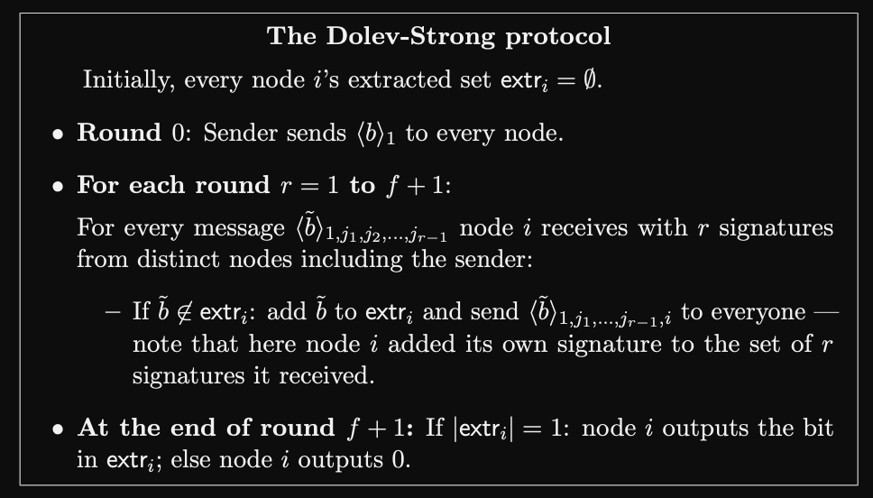

## Dolev-Strong Protocol 
- consensus of bits are either 0 or 1
- requires signatures from each of the nodes 
- n Nodes, f are evil 

- important part is the signature chain 
- if there are f evil nodes, than once you have f+1 rounds there will be atleast 1 honest node voting for a different value than the evil nodes which will lead to |extr| > 1 which leads to outputing 0

## Byzantine Broadcast Definition
- how do we know this is a good protocol? - leads to the definition of **byzantine broadcast**
  - consistency: honest nodes output the same value 
  - validitiy: if the sender is honest and sends b then all the honest nodes output b

## Streamlet Protocol 
- blockchain that deals with more than a single bit 
- 1 leader = 1 epoch - selected by random leader 
- assume f < n/3 
- block is propose by the leader, and every node votes if valid to every other node 
  - 2/3 * n votes by distinct nodes and extends one of the longest chains = confirmed 

- the important part is that if you get 2/3 votes its easy to prove consistency and validity 
  - 2/3 is a special number 
- requires a consistent clock across all nodes (eg, wait 10 seconds for leader to broadcast and collect votes or skip and move to next leader)
  - ETH vs SOL have different solutions to a consistent clock - ETH actually uses the local clock with some tricks (i think) while SOL requires the nodes to constently producing chained hashes to prove time has passed

## BTC 
- leader = defined by solving a crypto puzzel and the solution to the puzzel = their signature 
- broadcasted to everyone in the network 
- how do nodes guarantee consistency? - a leader could produce two blocks of different values and send both out to the network (this is what happens when two nodes solve the puzzel around the same time and broadcast times differ)
  - as long as they break the tie of what chain to build on in the same way they will both work on the same longest chain 
  - receiving a block which is invalid? / missing a block and recieving the next solved block - parent hash wont add up which will lead to communicating with other nodes to receive the missing block 

## Other Resources
http://elaineshi.com/docs/blockchain-book.pdf - best resource imo on basics
https://decentralizedthoughts.github.io/ - second best; good for cross-checking
https://www.youtube.com/watch?v=rKGhbC6Uync - good video series to learn more from 
https://nakamotoinstitute.org/literature/ - interesting historical notes on btc
