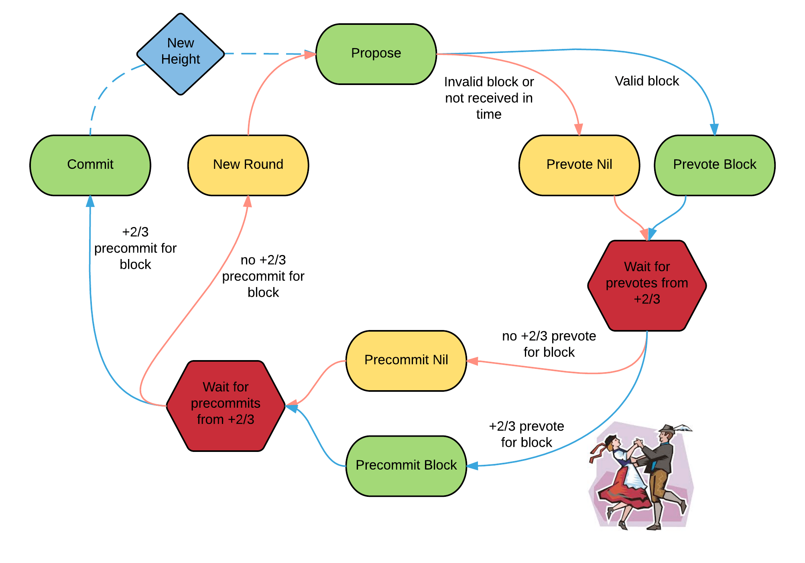

- this post will be basically a brain dump of some interesting thoughts 
on consensus (less blockchain) + blockchains

## consensus: pbft / tendermint

- the foundational paper on consensus is PBFT (which tendermint is largely based
off of)

- there are three main stages:
  - propose: leader sends out a block of txs 
  - vote: group of validators send out votes for the block 
    - "I have seen the block and its valid"
  - commit: group of validators send out votes on the votes 
    - "I have seen that everyone else has seen the block and knows its valid"

- you need >= 2/3 votes for the vote period, and >= 2/3 commit message for the commit stage to pass
- once the commit stage is passed, the block can be finalized

#### why do we need the commit stage? 

- you may think, why do we even need the commit stage, if you receive 2/3 votes on the block, then you should be able to commit it 
- the problem scenario where this doesnt work: 
  - is if you are the only one to receive the 2/3 votes, and no-one else receives any:
  - you end up updating your state, and noone else does (because they havent received any votes)
  - eventually, a timeout will occur and a new leader election will happen 
    - then you will have a state different from everyone else 
  - in tendermint/pbft, this scenario is solved using commit messages to convince the rest of the cluster that 2/3 of the cluster has received 2/3 votes and modified their state
  - and so you can reset for the last block which was committed
- [SRC](https://cs.stackexchange.com/questions/54152/why-is-the-commit-phase-in-pbft-necessary)

## blockchains and implicit ordering: btc

- another key idea in pbft is to order blocks by agreeing on a sequence number
- in PBFT, the naming is slightly different than above instead of propose, vote, commit, its pre-prepare, prepare, commit
- specifically, the pre-process and process stages include a few steps not mentioned in the above steps:
  1. choosing a sequence number for the transaction 
  2. leader broadcasts to the cluster **requesting** about a sequence number with its signature (preprocess) 
  3. each node broadcasts to every other node that they agree on the sequence number (process)

*note:* in step2 the leader signs all broadcasts, and in step3 the other nodes verify the signature with the expected leader of the schedule

- this requires two main things 1) agreeing on sequence numbers and 2) verifying signatures of the leader
- btc solves both these in a nice way 

- btc works by hashing the block to be less than some value (< 0x000.. - three leading zeros), 
along with a reference to the parent block's hash - its then broadcast to everyone

- since the hash includes the parents hash this inherently has ordering and is the same as a sequence number 
  - ie, solving 1) and removing the need for sequence numbers
- and since block is hashed to be less than some value they know it hasnt been tampered with, 
and that it comes from the leader (checkout the 
[BTC as a clock post](https://github.com/0xNineteen/blog.md/blob/master/contents/btc-consensus/index.md) for more on this) 
  - ie, solving 2) because you dont need signatures - your just verifying hashes

## proof of history and optimistic voting: solana

- solana's POH can also been viewed through the lens of PBFT 

*note:* checkout this [post on solanas leader schedule](https://github.com/0xNineteen/blog.md/blob/master/contents/sol-rpcs/index.md) for more

- compared to btc and tendermint, solana uses a very cool optimistic voting method 

- a block at slot N is broadcast (with a reference to its parent for ordering) (this is the pre-prepare)
- other nodes see the block, and generate vote txs on the block 
- these vote txs are included in some block in the future at slot M (M > N) 
  - viewing these 2/3+ vote txs (can be across multiple slots) you know 2/3+ have seen that block (this is the prepare)
  - these votes root the block at slot N 

*note:* these votes are normal transactions, and are included in on-chain compared to other off-chain voting methods 

- this process is continued for future blocks 
- when there are 2/3+ vote txs for the block in slot M then the block at slot N is confirmed 
  - 2/3 of nodes have seen the 2/3 votes for block N

### optimistic 

- notice how after block N is built and broadcasted, the network continues to generate new blocks that build ontop of it,
even though it hasnt received all the votes
- the network assumes the block will be valid, and continues to build off of it 
- optimstic = fast 
