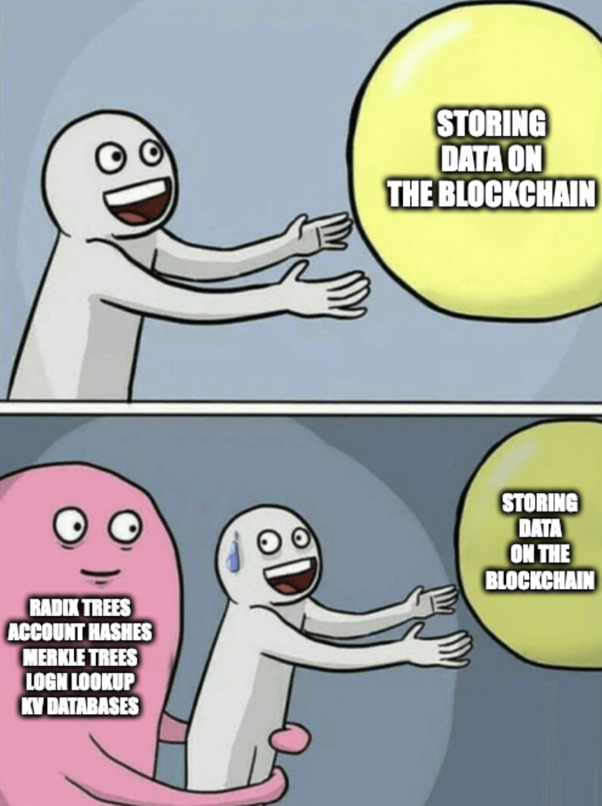
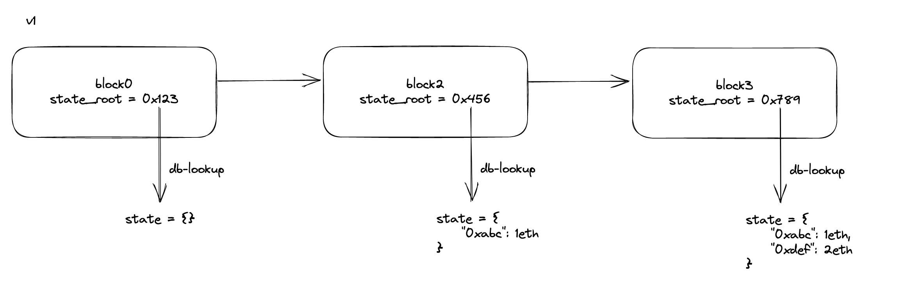
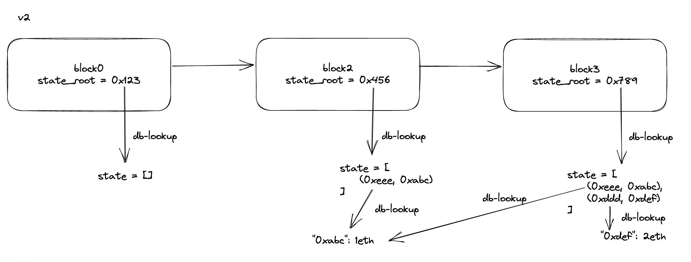
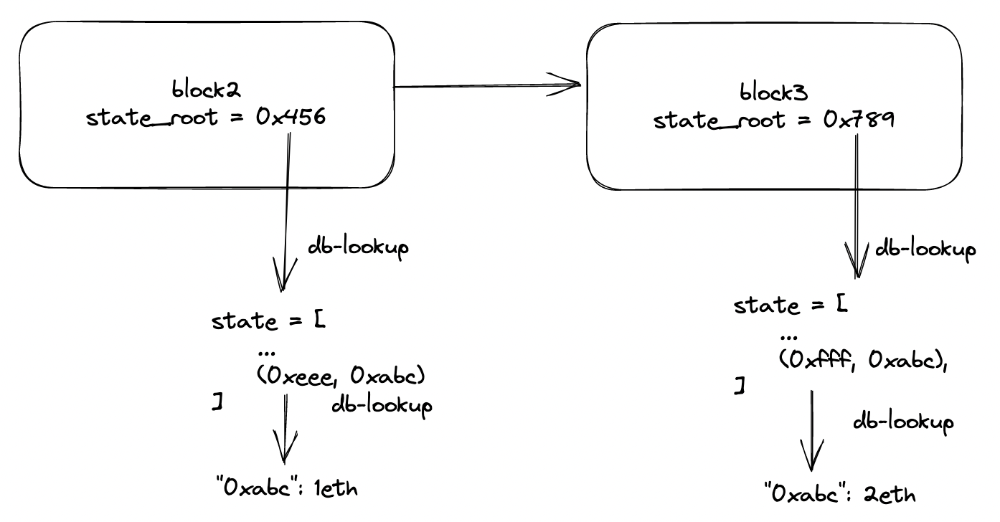

# Storing Data on the Blockchain: ETH

<div align="center">

</div>

one of the most important things in a blockchain is how to state is managed. it must be extremely memory and computationally efficient to scale to millions of accounts.

while there are a lot of posts on how eth does it, since the final solution is the product of many optimizations - i feel like the best way to understand it is by starting from a simple implementation and then 
optimizing it to eventually arrive at the final solution - which is exactly what we'll do in this post. 

the main structures well work with include:
- a user's account: well use a simple model of (user public key address => eth amount)
- a transaction: which will adjust a users account amount 
- a block: which references ... 
  - the parent's block hash (building the chain)
  - the state of the chain at that block (state root hash)

the main thing we want to be able to do is get the state at each block.

why do we need it at any point in time instead of just the most recent block? 
well, it will be useful for when we have forks which build off a block which isnt the head

ie, well need to get the previous blocks state, apply the transactions and continue to build the chain

*note:* full python code/implementations can be found in the folder

# simplest impl: clone everything (v1)

the simplest implementation (and very inefficient) we can start with is to have
state be a dictionary which maps a users address => amount. each block will represent a hash of the state, which can be looked up in a database to get the serialized dictionary of state.



to understand how it works well go through the cases of: 
  1) building the genesis block 
  2) looking up state 
  3) processing a transaction

## 1) building genesis 

to generate the genesis block we create an empty dictionary and store a reference 
from its hash (`state_root = hash({})`) to the serialized dictionary (`state.serialize()`) in the database (`db`). 
we then create the genesis block which includes the hash to the state and add it to the chain.

note: to generate the hash of the state well generate a merkle tree from the account hashes 
(you could also just hash all the accounts together).

```python
class Blockchain(): 
    def __init__(self) -> None:
        self.db = DB('blocks.db', resume=False)

        # init state
        self.state = State()
        state_root = self.state.generate_merkle_tree().root
        self.db.put(state_root, self.state.serialize())

        # init genesis block
        genesis = Block(bytes(0), state_root)
        self.chain = [genesis]
```

## 2) looking up state

looking up user accounts is straightforward:

```python 
def get_account(self, address): 
    head_block = self.chain[-1]
    state_root = head_block.state_root
    state = State.deserialize(self.db.get(state_root))
    return state.get(address) # state[address]
```

## 3) processing a new transaction

when processing a new transaction we get the state, process the transaction to get
a new state, re-generate the merkle tree of the new state (the hash of the state), 
and store it again in the database. 

note: even though we only change a single account we clone all the accounts and re-store it
in the database (very inefficient). similarily, we re-generate the entire merkle tree 
even though a single leaf has been changed.  

```python 
def process_tx(self, tx: Transaction): 
    parent_block = self.chain[-1]

    # NOTE: this is expensive state cloning (in terms of full account data cloning)
    state: State = State.deserialize(self.db.get(parent_block.state_root))
    state.process_tx(tx) # state[tx.address] = tx.amount

    # NOTE: this is expensive re-creating the merkle tree
    state_root = state.generate_merkle_tree().root
    self.db.put(state_root, state.serialize())

    # create the block 
    block = Block(parent_block.block_hash, state_root)
    self.chain.append(block)
```

# optimizing memory: account references (v2)

to reduce the amount of memory we are using/referencing we'll change the lookup to be `state_root => list[(account hash, address/public key)]`.  



this means for each block will clone `O(N)` account hashes instead of `O(N)` accounts data. notice how block3 and block2 both point to the same underlying data of account `0xeee`.

we store the state as a list of tuples `(hash, address)` so we can find the hash of a specific address easily. eg, `0xeee = hash({"0xabc": 1eth})`

## 1) building genesis 

the only differnce is the state is now a database and a list of account hashes: 

```python 
class State: 
    db = DB("state.db")
    
    def put_account(self, account: Account): 
        # store: account_hash => account
        self.db.put(account.hash_bytes(), account.serialize())

    def generate_merkle_root(self):
        # list of (hash, address) we hash all the account_hashes
        return hash([bytes(h, 'utf-8') for h, _ in self.account_hashes])

    def serialize(self): 
        return bytes(json.dumps(self.account_hashes), "utf-8")
```

and then creating the genesis is the same: 

```python 
class Blockchain(): 
    def __init__(self) -> None:
        # init state/genesis block
        state = State()
        state_root = state.generate_merkle_root()

        self.db = DB('blocks.db', resume=False)
        self.db.put(state_root, state.serialize())

        # NOTE: this doesnt support forks 
        genesis = Block(bytes(0), state_root, bytes(0))
        self.chain: list[Block] = [genesis]

```

## 2) looking up state

getting state is simply getting the list of hashes and finding the address you want: 

```python 
def get_account(self, address) -> Account: 
    head = self.chain[-1]

    # lookup parent block's state
    state = State.deserialize(self.db.get(head.state_root))
    state_account_hashes = state.account_hashes

    # find account
    address_hash = [h for (h, addr) in state_account_hashes if addr == address]
    if len(address_hash) == 0: return None # DNE
    address_hash = address_hash[0]

    account = state.db.get(address_hash)
    account = Account.deserialize(account)

    return account
```

## 3) processing a new transaction

the key to processing a transaction is to: 
  1) lookup previous account state
  1) modify the account 
  2) generate the new account hash 
  3) modify the list of account hashes (to include the new account's hash)
  4) generate a new state root (from the new list of account hashes) 
  5) store the account + new state root in the db 
  6) build a block using the new state root. 

```python 
    def process_tx(self, tx: Transaction): 
        parent_block = self.chain[-1]

        # lookup parent block's state
        state = State.deserialize(self.db.get(parent_block.state_root))
        state_account_hashes = state.account_hashes

        # find the tx's address account in the account hashes
        address = tx.address
        address_hash_index = [i for i, (_, addr) in enumerate(state_account_hashes) if addr == address]

        if len(address_hash_index) == 0: 
            # account DNE -- init account 
            account = Account(tx.address, tx.amount)

        else: 
            assert len(address_hash_index) == 1 
            # lookup existing account
            i = address_hash_index[0]
            address_hash, _ = state_account_hashes[i]
            account_data = state.db.get(address_hash)
            account = Account.deserialize(account_data)

            # modify account with tx
            account = account.apply(tx)

            # update state_account_hashes 
            del state_account_hashes[i]

        # put new account in db
        state.put_account(account)

        # update new state root
        state_account_hashes.append((account.hash(), tx.address))
        new_state = State(state_account_hashes)
        state_root = new_state.generate_merkle_root()
        self.db.put(state_root, new_state.serialize())

        # create new block 
        block = Block(parent_block.block_hash, state_root, tx_root)
        self.chain.append(block)
```

for example, changing `0xabc`'s account from `1eth` to `2eth` would be the following: 



notice how we remove the old hash (`0xeee`), append the new hash, and insert the new account into the db. 

# optimize optimize: tree structures and Log(N) (v3)

v2's memory consumption is only O(N) hashes when updating an account, but we can do better! 

instead of using a list of N hashes, if we organize them using a tree (eth uses a radix tree) which utilizes pointers/branches, an update will only require $O(log_b(N))$ hash clones, where b is the branching factor of the tree. 

since we are using the hex-value of the hashes we can have `b=16` for the possible hex values and instead of using `list[(hash, address)]` it will be a key-value tree of `tree((hash, address))`.

we can improve the structure even more and get a merkle tree for free, if we make the hash reference the hash of its child! 

thats two datastructures in one and O(log(N)) clones on update and is essentially what eth's state trie is! 

--- 

fin