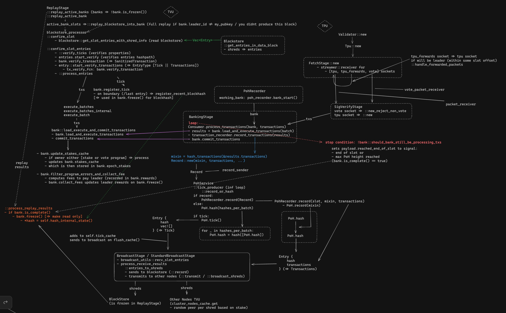
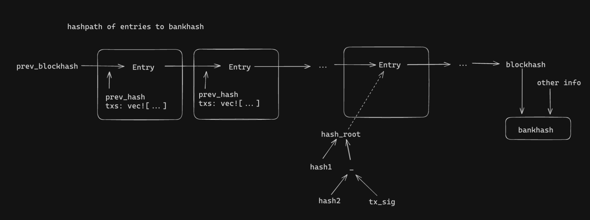

# Building Blocks in Solana

This post will explain how blocks are built in solana-labs client using the 
diagram below as a reference:



Theres two main stages when producing blocks:
  - The Transaction Processing Unit (TPU) stage: when you **are a leader**
  and need to build a block
  - and The Transaction Validation Unit (TVU) stage: when you **are not 
  a leader**, and you receive a block from a leader, and need to replay the 
  block to reproduce the state

## TPU Flow

We'll start with the TPU (the top right in the diagram)

### receiving txs 

In solana, there is no mempool, txs are forwarded directly to the leader.
So, when starting a validator, dedicated ports are opened to receive these txs
including:
  - `tpu`, `vote`, and `tpu_forwards` sockets
  - the tpu socket is for normal txs (eg, { send token A to bob })
  - the vote socket is only for votes 
    - votes are a special transaction which only validators send - 
    when a validator sends a vote tx they are saying that a specific block 
    is valid (the tx data includes the hash of the block which they are voting for)
  - the tpu_forwards socket is less important for this post, so we'll leave it alone

txs and votes are received, signatures are verified and are then sent to the 
`BankingStage`

*note:* txs are sent to the banking stage in batches, **as they're received**, so sometimes
the banking stage will be operating on a large number of txs, 
and other times a small number of txs

*note:* for more info on how txs flow checkout
[this post](https://github.com/0xNineteen/blog.md/blob/master/contents/sol-rpcs/index.md)

### the banking stage 

This stage is responsible for building new blocks from the txs received from 
the previous stage.

*note:* the `bank`/`Bank` struct is used to represent accounts and metadata per slot
so the *bank*ing stage is responsible for building a valid bank

We wont go in-depth on the code for this bc it should be a post on its own
but there are three main stages:
  - executing txs to get a new state: `bank.load_and_execute_transactions`
  - sending txs to the proof-of-history (PoH) generator: `transaction_recorder.record_transactions`
  - and recording other info related to the 
  block (storing the updated accounts, caching current stakers, collecting 
  validator fees, etc.): `bank.commit_transactions`
 
The first and third are fairly straightforward at a high level, the second one is where things get interesting

### proof-of-history and the `Entry` struct 

The receiver from the previous stage's 
`transaction_recorder.record_transactions` 
receives a batch of txs and aims to produce a PoH hashchain.

PoH, at a high-level, is an infinite hash loop which hashes itself over and 
over. And since hash functions are 
one-way functions, the hash loop is a proof that some time has passed.
This passage of time acts as a consistent clock, which in turn runs the 
leader schedule. 
  
**The loop produces hash entries which are either 1) a loop of empty hashes or 2) a loop with tx hashes mixed into it.**
The key structure representing this is the `Entry` struct:

```rust 
pub struct Entry {
    /// The number of hashes used in this entry
    pub num_hashes: u64,

    /// The final SHA-256 hash `num_hashes` after the previous Entry ID.
    pub hash: Hash,

    /// An unordered list of transactions which were mixed into the hash 
    /// either 1) an empty vector (ie, a Tick) or 2) a Vec<txs>
    pub transactions: Vec<VersionedTransaction>,
}
```

Each entry builds off the hash of the previous entry and so 
  - the first entry begins the hash of the last block's `blockhash` 
  - the second begins off the first entry's hash 
  - ... 
  - the last entry's final hash is that block's `blockhash`

The goal is to create a `Vec<Entry>` which represents a block/slot. 

### mixing txs into the PoH

Its also worth it to understand how txs are included/mixed-in to 
produce an `Entry`.

Each batch of txs is hashed using a merkle tree using the tx signature (which 
is just a signed hash of the tx message). The merkle root of this tree 
would uniquely represent the batch of txs. The merkle root is then sent to 
be 'mixed in' with the PoH.



Below is pseudocode of what we want to do: 

```python 
# start entry hash = previous blocks last entry hash
parent_hash = state.get_parent(slot)
last_hash = parent_hash

# produce the PoH entry loop
entries = []
while should_produce_block: 
    # recieved from the banking stage
    txs: Vec<Transaction> = state.receive_new_txs()?

    if txs.is_not_empty():
      tx_root = compute_merkle_root(txs)
      entry_hash = hash([last_hash, tx_root])
    else: 
      entry_hash = hash([last_hash])

    entries.push(Entry { entry_hash, txs })

    # make it a chain
    last_hash = entry_hash 

# these entries now represent a full block/slot

# explained soon
shreds = shred_entries(entries)
broadcast(shreds)
blockstore.store(shreds)
```

### broadcasting entries and wtf is a shred

as these entries are produced, they are given to the `BroadcastStage` 
to be broadcasted to the rest of the network.

since blocks are too big to send over UDP directly, solana splits a 
block into smaller chunks called **shreds**. these shreds go to two places: 

1) they are sent to the blockstore
2) they are transmitted to other node's TVUs in the network using turbine

*note:* the blockstore is a local rocksDB database, and stores a bunch of 
useful metadata about the chain, 
including all shreds

*notice:* though we havent talked about it yet, in the TVU, shreds are 
received by 
the network and stored in the blockstore - which are then later read ---
so notice how by storing the shreds in the blockstore in the TPU too, even 
when you produced 
the entries yourself, you can make use of the same codeflow as the TVU - 
this will make more sense when we talk about the TPUs flow 

### when are we no longer the leader

the node stops producing blocks of txs after reaching the max PoH height which is decided by two things:
  - either the max number of 'ticks' (hash loops) were produced
  - or the bank was created more than ns_per_slot time ago 
    - note: ns_per_slot is computed based on the max ticks per slot and 
    the time it takes to produce a single hash

*note:* even when were no longer the leader, the PoH infinite loop will 
still continue, just no new txs will be mixed in

for example, say the block at slot 19 is ok, and the leader of slot 20 never 
produces a block (bc its offline of smthn), if you start building a new block 
for slot 21, you'll need to also share your PoH loop which covers the time 
in slot 20 to prove you waited the full slot time before starting to produce 
the block for slot 21

## TVU 

Next, we'll dive into how the TVU works (starting at the top left of the 
diagram).

for some background on the TVU, checkout [this post](https://github.com/0xNineteen/blog.md/blob/master/contents/sol-tvu/index.md)

- if you dont want to read that post, the tldr is: shreds from the leaders TPU are
received on dedicated TVU sockets, verified they were signed by the leader, 
and stored in the blockstore.

we'll start at the `ReplayStage` which replays entry txs to 
reproduce the state which the leader propagated to the network

### finding a bank to replay

One of the most important functions in the replay stage is 
`::replay_active_banks` which reads from the `bank_forks` variable to find 
banks that should be worked on.

at a highlevel, the `bank_forks` variable is
responsible for organizing all the node's banks.

*note:* a bank is either frozen: read-only and cannot be modified, or active:
its state can be modified -- a bank is always initialized as active -- we'll cover how a bank is frozen later

the first thing the fcn does is find all 'active' banks in the bank_forks var,
which loops over the banks and takes the blocks which aren't frozen

### reading entries from the blockstore

after finding active banks, for each of these active banks, we query the 
blockstore for the associated entries using `blockstore::get_slot_entries_with_shred_info`

*note:* since entries aren't all propagated at once, the blockstore 
wont always have all the entries, so calling the above 
fcn is not guaranteed to return all the entries - the solution is to track the 
progress (using the index of the last-processed entry), and only process 
entries with a larger index on the next loop, and lastly freezing the bank 
when all the entries have been processed (which is exactly what the
`ConfirmationProgress` struct does)

```python 
while true: 
  # only process active banks
  active_banks = state.get_active_banks()

  # note: this loop can also be done in parallel 
  for bank in active_banks: 
    # process the unprocessed entries 
    (entries, indexs) = blockstore.get_entries_for_slot(bank.slot(), start_index=bank.progress.last_index)

    ## to be explained
    verify(entries)
    process(entries)

    # track the progress of processing entries 
    bank.progress.last_index = indexs[-1]

    if indexs[-1].is_last_index(): 
      bank.freeze()
```

*note:* once all the entries of a bank have been processed, the bank will be 
frozen (and thus, no longer 'active') and so it wont be considered in the 
replay loop.

after getting the entries, we then need to verify the entries are valid: ie, 
certain 
properties hold (using the `::verify_ticks` fcn), that the entries are a valid 
PoH chain 
(`hash([last_hash, tx_root]) == entry.hash`), all the transactions include 
valid signatures

### processing entries and replaying a bank

we now have a batch of verified PoH entries for a specific slot which we 
want to process

*note:* since TPU blocks (whose state has already been processed) are also 
following this code flow, before fully replaying the block, we only fully replay 
a bank if `bank.collector_id() != my_pubkey` (ie, you werent the leader for that bank)

to process the entries the code uses `::process_entries` which loops through 
the entries and either registers ticks (entries with no txs)
or processes transactions in the entries (`txs`):
- on a `tick` entry: each tick is registered and on the last tick, that entries hash is 
recorded as that bank's `blockhash`
- on a `tx` entry: processing txs uses the same fcns as the TPU 
(`load_and_execute_transactions` and `commit_transactions`)

### freezing banks

after all the ticks and txs are processed, if the bank is complete
(enough ticks have been registered/have processed all the entries), its frozen (using `bank.freeze()`)

this is the long arrow on the left side of the diagram

freezing a bank, hashes its internal state (which is called a `bankhash`) and 
makes it read-only. a bank's internal hash consists of the following: 
- the parent's bank hash (putting the chain in block-chain)
- a hash of the accounts modified (recording the state)
- the signature count (something to do with dynamic fees?)
- and its `blockhash` (recording the PoH and txs included)

*note:* TPU banks are also frozen here

if all of this is works ok, and the block is valid, then validators produce vote transactions which are a signature on a bank's `bankhash`. 

## fin

thanks for reading! :) 