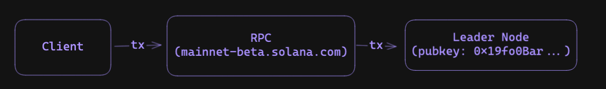
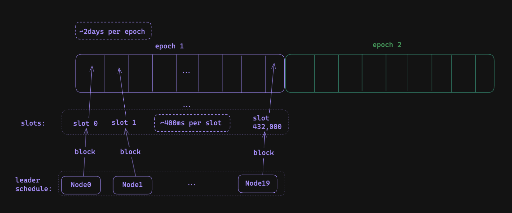
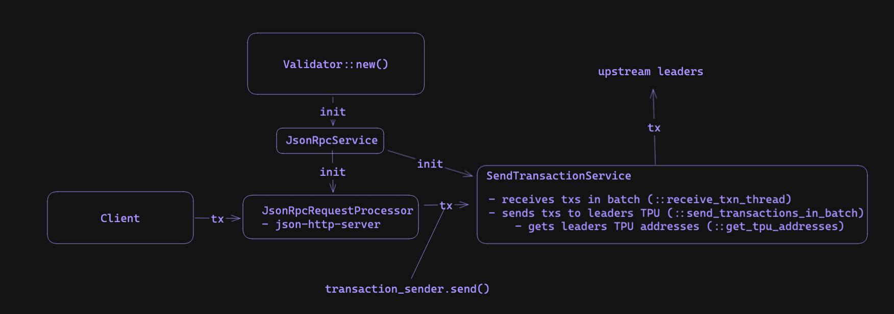
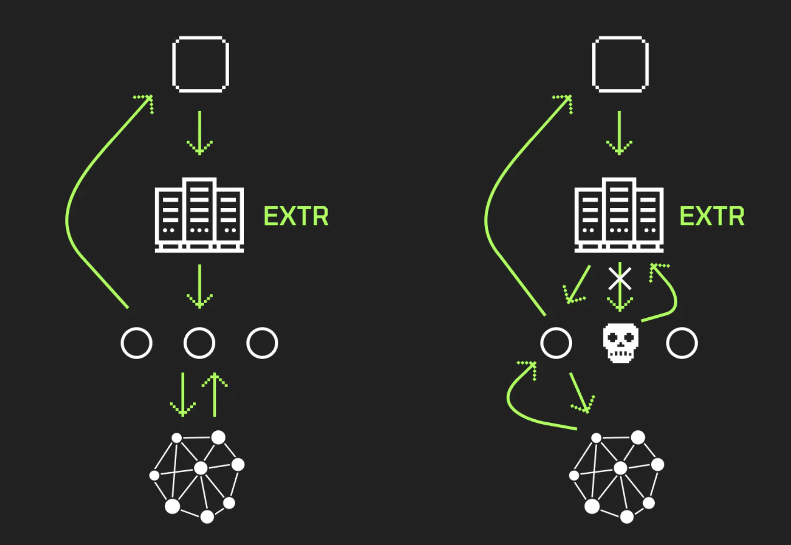
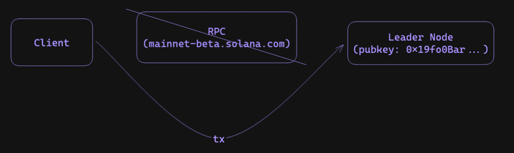

# Solana: Sending Transactions and Open-Source RPC Projects

this post will be about recent rpc developments which i think are particularly cool within the solana ecosystem:
  - extrnode which is a rpc loadbalancer
  - mango's lite-rpc which forwards txs directly to leaders without requiring a full node 

utilizing these two solutions correctly can improve your tx sending/confirming process by a lot. to understand how these two solutions are interesting, well also learn a bit about how txs included in blocks in solana and dive into validator code.

## sending a transaction

First, we need to understand how a transaction (tx) is sent on Solana. Note there are many resources available on the topic (see references section), however, I'll provide a brief overview with a focus on diving into the validator code to provide more depth.

typically, when you send a transaction to the network the flow is:
- your client code (Python or UI/JavaScript) sends the transaction to a full node's RPC (Remote Procedure Call). 
  - This RPC could be something like 'mainnet-beta.solana.com'. 
- the RPC, being aware of the next leader or block producer node, directly forwards the transaction to that leader. 
- once the leader receives the transaction, they include it in a block and broadcast it to the other nodes.



## the leader schedule

the RPC can determine which leader to send the tx to by using a leader schedule derived from the list of staked validators and the current epoch. 

a leader schedule lasts for one 'epoch' amount of time (~2 days for Solana). this epoch is further divided into slots each lasting around 400 milliseconds, where each slot is assigned a specific leader to produce a block for that slot. 



accessing this information in real time from any RPC is easy to do:

```python 
from solana.rpc.api import Client

client = Client("https://api.mainnet-beta.solana.com")

# {'absoluteSlot': 192467130, 'epoch': 445, 'slotsInEpoch': 432000, ... }
print(client.get_epoch_info())

# { node_public_key: [slots where this node is a leader] }
# {"4Qkev8aNZcqFNSRhQzwyLMFSsi94jHqE8WNVTJzTP99F": [0, 1, 2, 3, 4, ...], "EkSnNWid2cvwEVnVx9aBqawnmiCNiDgp3gUdkDPTKN1N": [10, 11, 12, ...],}
print(client.get_leader_schedule())
```

## code: constructing the leader schedule 

we can also dive into the validator code base and see exactly how the leader schedule is constructed (code is fully explained in the comments):

```rust 
// src: `ledger/src/leader_schedule_utils.rs`

/// Return the leader schedule for the given epoch.
pub fn leader_schedule(epoch: Epoch, bank: &Bank) -> Option<LeaderSchedule> {
    // the bank stores the validators which have staked SOL in this epoch (we construct the schedule from this)
    // note: this requires all nodes to have the same bank at epoch boundaries to get consistent leader schedules
    bank.epoch_staked_nodes(epoch).map(|stakes| {

        // this seed makes sure our random sampling is consistent across all nodes 
        // (based on the epoch's bytes)
        let mut seed = [0u8; 32];
        seed[0..8].copy_from_slice(&epoch.to_le_bytes());
        let mut stakes: Vec<_> = stakes
            .iter()
            .map(|(pubkey, stake)| (*pubkey, *stake))
            .collect();
        sort_stakes(&mut stakes);

        // we construct the schedule here
        LeaderSchedule::new(
            &stakes,
            seed,
            bank.get_slots_in_epoch(epoch),
            NUM_CONSECUTIVE_LEADER_SLOTS,
        )
    })
}

// src: `ledger/src/leader_schedule.rs`
impl LeaderSchedule {
    pub fn new(
      ids_and_stakes: &[(Pubkey, u64)], // staked SOL amount for the nodes
      // note: each node is identified by its unique publickey
      seed: [u8; 32], // random seed
      len: u64,  // number of slots 
      repeat: u64 // keep the same leader for `repeat` number of slots
    ) -> Self {
        let (ids, stakes): (Vec<_>, Vec<_>) = ids_and_stakes.iter().cloned().unzip();
        let rng = &mut ChaChaRng::from_seed(seed);

        // higher stake weight = more likely to be a slot leader
        let weighted_index = WeightedIndex::new(stakes).unwrap();
        let mut current_node = Pubkey::default();

        // randomly sample leaders based on stake 
        let slot_leaders = (0..len)
            .map(|i| {
                // repeat the same leader for `repeat` slots
                if i % repeat == 0 {
                    current_node = ids[weighted_index.sample(rng)];
                }
                current_node
            })
            .collect();

        // ... other stuff (not critical) ...
    }
    // ...
}
```

## code: sending a transaction

to process txs, the validator initiates a new `JsonRpcService` (using `JsonRpcService::new()`) which initializes both a `JsonRpcRequestProcessor` and a `SendTransactionService`. 

the **`JsonRpcRequestProcessor` service runs an http server** to receive all the RPC requests. when a `send_transaction` RPC request is received, it sends the transaction to the `SendTransactionService` using the `meta.transaction_sender` channel. 

the **`SendTransactionService` service loops through receiving new transactions and sending them upstream to upcoming leaders** (based on the leader schedule). This includes calling `get_tpu_addresses` to get the upcoming leader's TPU address and `send_transactions_in_batch` which sends the transactions to the leader's TPU.



# when RPCs stop working

One problem is if the RPC you rely on crashes or stops working (due to hardware failures, too many requests, etc) and you arent able to send txs to the leader anymore.

## rpc load-balancing: extrnode

One possible solution is to **maintain a list of RPCs and when one fails, you switch RPCs and query 
ones that are still alive**. While this approach seems straightforward, it can be 
costly to implement, involving managing multiple RPC links, implementing health checks, and 
writing code to switch between RPCs in case of failure. 

however, theres good news, the extrnode project has implemented exactly this as a independent service that can be run locally. even better, the code is open source and available on github 
at [https://github.com/extrnode](https://github.com/extrnode). You can even find a list of hundreds of available RPC endpoints on their github. 



## how it works

its also interesting to understand how they implemented this:
- they first connect to a single full node RPC
  - then using the [`getClusterNodes` API call](https://docs.solana.com/api/http#getclusternodes), it queries the node to receive a list of all other nodes that node knowns through the gossip protocol
- repeating this RPC call against all the new nodes, they can get the IP addresses of all the validator nodes on the network 
- from this, they have a list of nodes which they can load-balance RPC requests between

## other utilizations

other than load-balancing RPCs on failure, there are many other cool things you could do with this: 
- improve the speed of requesting blocks/information by splitting your queries between nodes (avoid spamming a single RPC)
- subscribe/send requests to nodes which are physically closer to you to reduce request latency
- verify tx status' across many different nodes for extra confirmation
- ... and likely much more


## direct tx forwarding: mango's lite-rpc

Another solution is to avoid the jump from client => RPC altogether by **sending it directly to the leader**.



this would require constructing the leader schedule locally to know which node to forward your 
transaction to. while currently, this would require running a full node (with large hardware 
requirements - not suitable for running locally), mango is working on a solution called 
'lite-rpc'. better yet, its also open source and being built out now: [https://github.com/blockworks-foundation/lite-rpc](https://github.com/blockworks-foundation/lite-rpc)!


# references 
- [https://github.com/blockworks-foundation/lite-rpc](https://github.com/blockworks-foundation/lite-rpc)
- [https://github.com/extrnode](https://github.com/extrnode)
- [https://jito-labs.medium.com/solana-validator-101-transaction-processing-90bcdc271143](https://jito-labs.medium.com/solana-validator-101-transaction-processing-90bcdc271143)
- [https://docs.solana.com/cluster/leader-rotation](https://docs.solana.com/cluster/leader-rotation)
- [https://medium.com/solana-labs/gulf-stream-solanas-mempool-less-transaction-forwarding-protocol-d342e72186ad]( https://medium.com/solana-labs/gulf-stream-solanas-mempool-less-transaction-forwarding-protocol-d342e72186ad)
- [https://jstarry.notion.site/Transaction-confirmation-d5b8f4e09b9c4a70a1f263f82307d7ce](https://jstarry.notion.site/Transaction-confirmation-d5b8f4e09b9c4a70a1f263f82307d7ce)