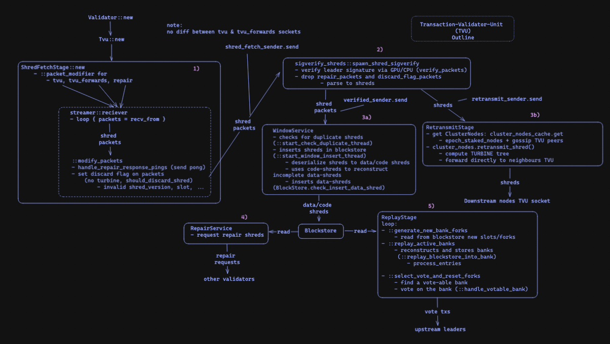
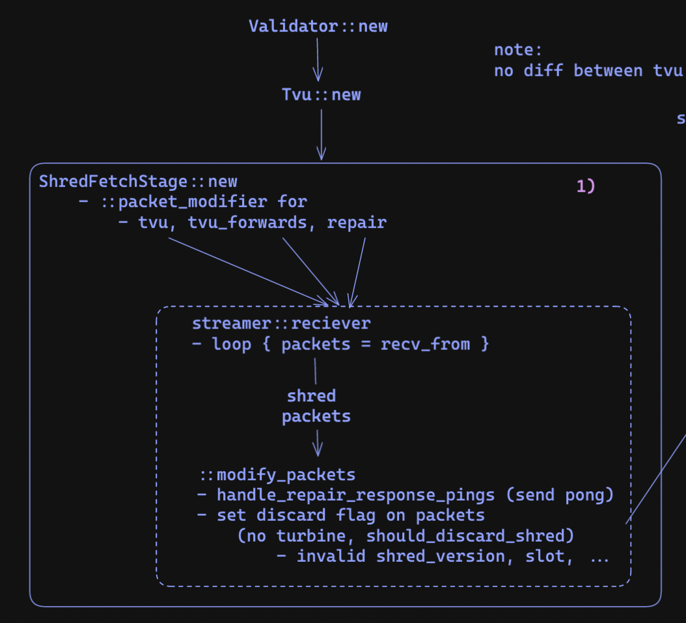
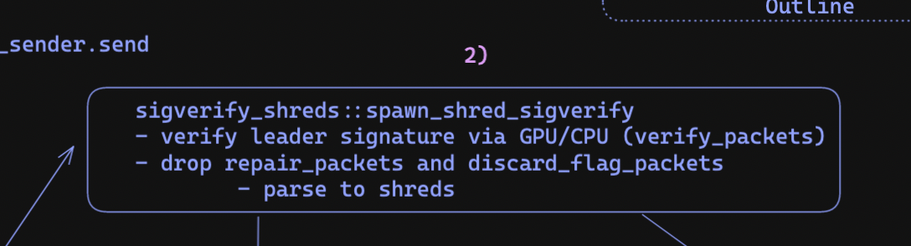

# TVU: tx validator unit 

- you can follow along by searching the codebase for keywords
- it starts when you run your validator, and `Validator::new` is called
- this init a lot of things, including the TVU with `TVU::new`
  - transaction processing unit 
  - main focus is to recieve blocks from others, update their chain with the new blocks, and send votes on those blocks 
- init the TVU starts with a few main stages 
  - shred fetch stage 
  - sigverify stage 
  - retransmit stage 
  - window service 
  - repair service 
  - and the replay stage 
- well cover what each of these stages are doing 

## shred fetch stage

- the first stage is the 'shred fetch stage'
  - three ports are opened: 
    - TVU, TVU_forwards, and repair ports 
    - the TVU port will recieve shreds (shreds are parts of a block)
    - the repair port will recieve repair responses (well talk more about this in the repair service section)
    - note: the TVU_forwards port isnt used anymore ([ref](https://github.com/solana-labs/solana/pull/17716))
  - for each of these ports, a thread is used to recieve packets (`streamer::reciever`) and modify them to include meta-data (`::modify_packets`) to either discard the packet or not
    - packets are discarded if the `shred_version` is different (`shred_version` is a reference to what hardforks the validator has gone through), its from an invalid `slot`, and more
      - full filtering can be found in the function `should_discard_shred`
  - all these shreds are then sent to the `sigverify_shreds` stage through the `shred_fetch_sender` channel 

## sigverify stage 

- the sigverify stage is straightforward, it verifies that the shreds from each slot are signed by the leader of that slot using either the GPU (if available) or the CPU
  - this is done in the `verify_packets` function located in `core/src/sigverify_shreds.rs`
- when the shreds are verified they are passed to the `WindowService` and the `RetransmitStage` using the `verified_sender` channel and the `retransmit_sender` channel respectively 

## retransmit stage :: turbine

- in the retransmit stage, the goal is to transmit the shreds recieved to the rest of the network
- to do this, the node retrieves a list of all the nodes it knowns: including staked nodes and gossip peers who have a valid TVU port
- it then computes the **turbine** tree to know which level its in and which neighbours it should retransmit the shreds to
- the shreds are forwarded directly to the neighbours TVU port

## window service 

- the window service handles removing duplicate shreds (using the function `start_check_duplicate_thread`) and inserting shreds into the `blockstore` (using the function `start_window_insert_thread`)
- to insert the shreds into the blockstore, we first decode the packets into shreds and sort them into two types (see the `ShredType` enum)
  - `ShredType::Data` or data shreds is the data contained in the shreds 
  - `ShredType::Code` is the erasure information used to recover missing data shred information 
- the data shreds are inserted into the blockstore (solana's custom database - **cloudbreak**)
- code shreds are used to reconstruct data shreds, which are then inserted into the blockstore like normal 

## repair service 

- the repair service sends requests to other validators for missing shred data (in case we never recieved it or were never able to reconstruct it with the code shreds)

## replay stage 

- the replay stage is responsible to tracking and updating the state of the chain 
- it continually loops on the following 
- it first reads shreds from the `blockstore` for new shreds for slots and creates `bank_forks` using the `::generate_new_bank_forks` method
  - `bank_forks` includes the chain and the forks in the chain
- it then reads the new blocks from the `blockstore` and replays the transactions to create a new `bank` / state
  - `banks` are states of the chain - each slot will correspond to a single bank 
- the replay stage also votes on forks using the function `select_vote_and_reset_forks` which finds a vote-able bank, constructs a vote transaction, and then sends it to the upstream leaders 