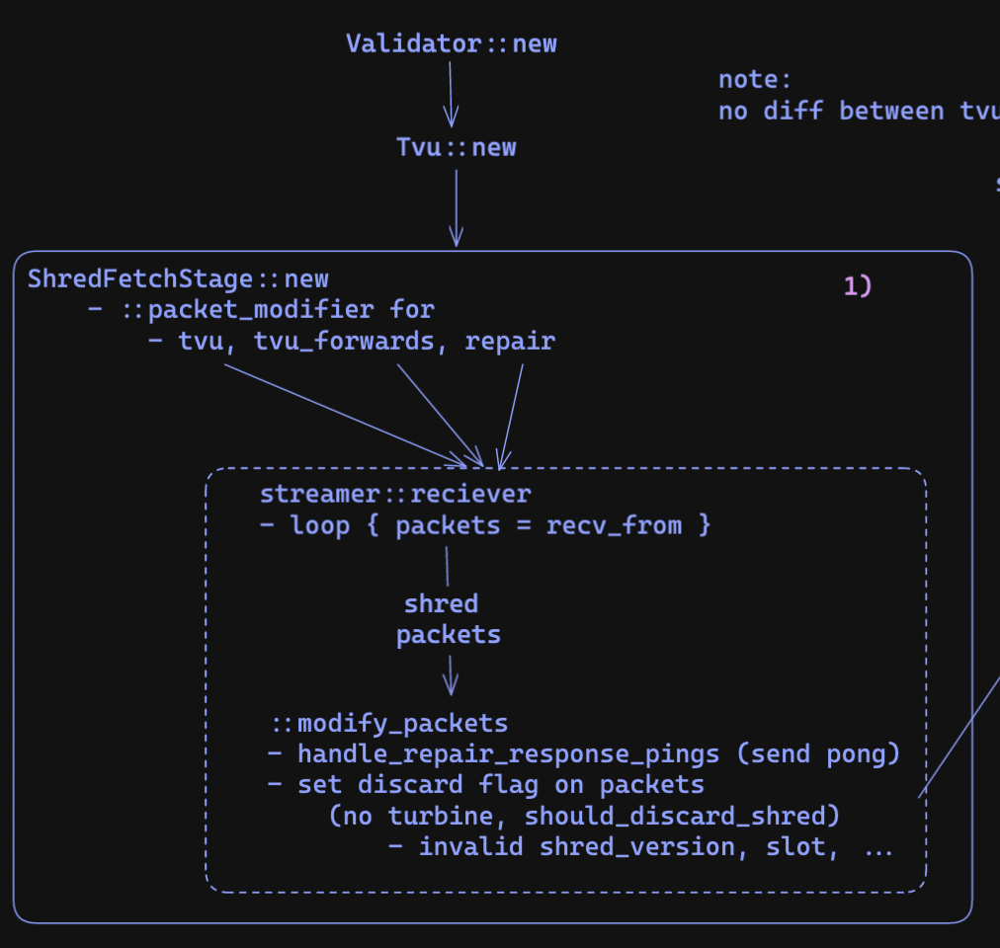
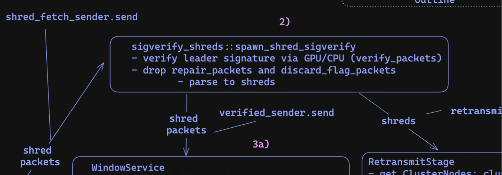
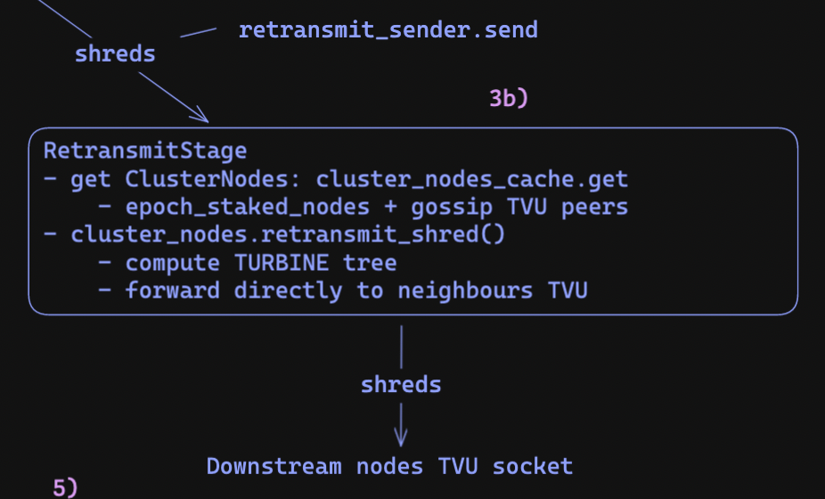
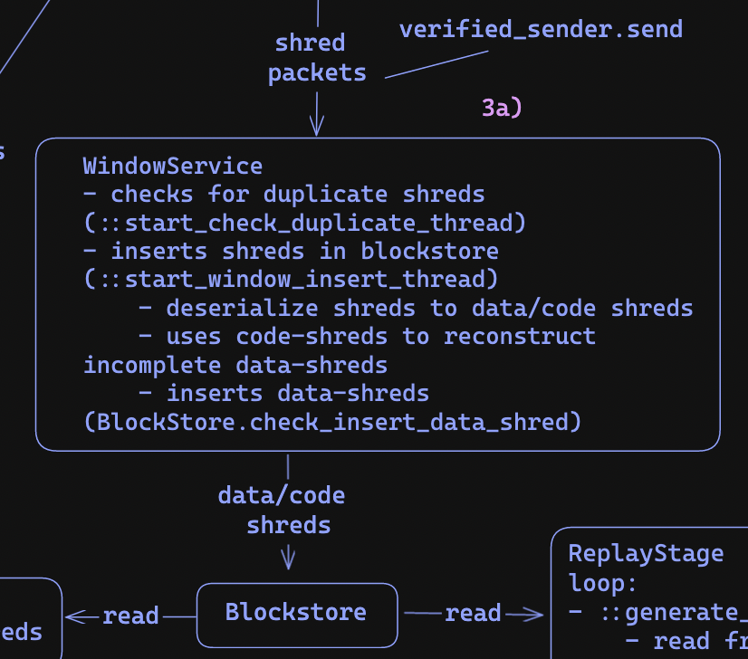
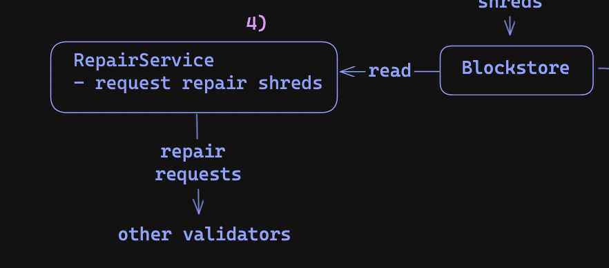
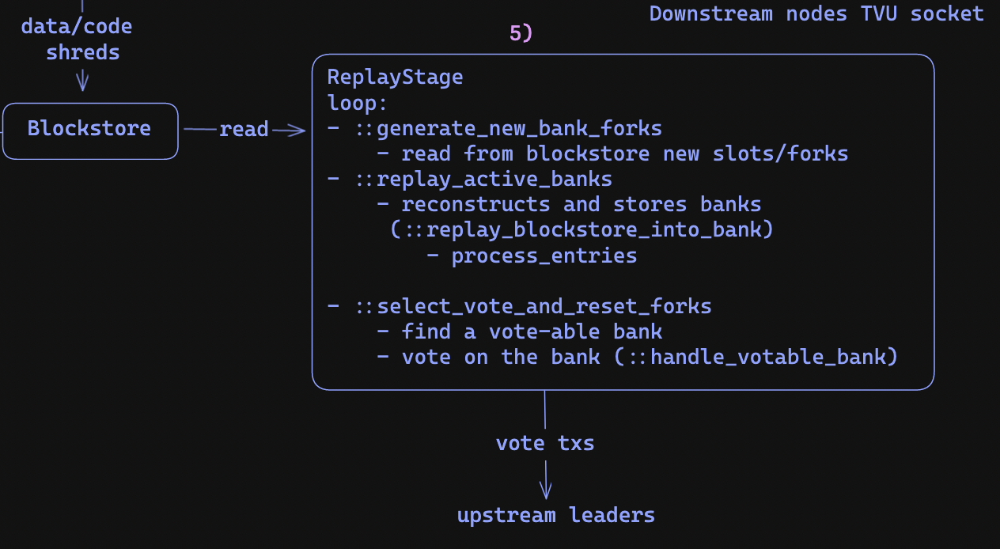

# Solana's TVU: the transaction-validating unit 

One of the main components in Solana's validator node is the Transaction-Validating Unit (TVU) whos task is to verify, process, and vote on new blocks from the network. In this post, we will cover how the TVU works and its main stages. 

To follow along, this post uses commit `c5905f5`

## Background: leader schedules

If you need a refresher on leader schedules check out [this post](https://github.com/0xNineteen/blog.md/blob/master/contents/sol-rpcs/index.md).

## Starting the validator

When you run the validator binary, it creates a new `Validator` instance using the
`Validator::new` method. This initialization process sets up many components, including 
the `TVU` using the `TVU::new` method. 

The initialization of the TVU sets up several stages, including: 
- the shred fetch stage 
- the sigverify stage 
- the retransmit stage 
- the window service 
- the repair service 
- and the replay stage 

we'll cover the details of how each of these stages/services work.

*note:* there are more stages we won't cover in this article.


## the shred fetch stage

The first stage is the `ShredFetchStage`, which receives shred packets from other nodes. These packets are either 
received directly from the leader or forwarded by other nodes. Since a block is too large to directly transmit over UDP, Solana 
divides them into smaller chunks called shreds, which are sent through Solana's [Turbine](https://docs.solana.com/cluster/turbine-block-propagation) block propagation mechanism.

<div align="center">

</div>

To receive these packets, two main sockets are opened: the `tvu_socket` for receiving shreds and the `repair_socket` for handling repair responses. The repair service will be further discussed later on.

*note:* the tvu_forwards socket isnt used anymore ([ref](https://github.com/solana-labs/solana/pull/17716))

```rust
// src: core/src/tvu.rs

let TvuSockets {
    fetch: fetch_sockets, // TVU socket
    repair: repair_socket, // repair socket
    // ... other ports
} = sockets;

// ... 

let fetch_stage = ShredFetchStage::new(
    // input sockets
    fetch_sockets,
    forward_sockets,
    repair_socket.clone(),

    fetch_sender, // output of phase
    tvu_config.shred_version,
    bank_forks.clone(),
    cluster_info.clone(),
    turbine_disabled, // if retransmit stage should be enabled
    exit,
);
```

For each of these sockets, new threads are spawned to receive packets using the `streamer::receiver` function and then are passed to the `::modify_packets` function to add meta-data including whether the packet should be discarded or not. 

Several factors contribute to packet discard decisions, including a mismatch between the shred's `shred_version` 
and the validator's `shred_version`, if the shred has an invalid `slot`, and more. The full logic can be found within the `should_discard_shred` function.

*note:* The `shred_version` references the hard forks that the validator has undergone.

```rust 
impl ShredFetchStage {
  // ...

  // receives packets from the socket
  let (packet_sender, packet_receiver) = unbounded();
  let streamers = sockets
      .into_iter()
      .map(|s| {
          streamer::receiver(
            packet_sender, // send to modifier
            // ...
          )
      })
      .collect();

  // sets discard on packet if invalid and/or if turbine is disabled ...
  let modifier_hdl = Builder::new()
      .name("solTvuFetchPMod".to_string())
      .spawn(move || {
          Self::modify_packets(
            packet_receiver, // receives from receiver
            shred_fetch_sender, // sends to sig verify 
            // ...
          )
      })
      .unwrap();

}
```

All the shreds are then sent to the `sigverify` stage through the `shred_fetch_sender` channel.

## the sigverify stage 

The sigverify stage verifies the authenticity of the shreds by ensuring they are signed by the leader of the corresponding slot (using either the GPU (if available) or the CPU) using the `verify_packets` function found in `core/src/sigverify_shreds.rs`.

<div align="center">

</div>

```rust 
let shred_sigverify = sigverify_shreds::spawn_shred_sigverify(
    cluster_info.clone(),
    bank_forks.clone(),
    leader_schedule_cache.clone(),
    fetch_receiver, // output from the shred-fetch stage
    retransmit_sender.clone(), // send to the retransmit stage
    verified_sender, // send to the window-service
);
```

Once the shreds are verified, they are passed to two components: the `WindowService` and the `RetransmitStage` using the `verified_sender` channel and the `retransmit_sender` channel respectively.

## the retransmit stage

The retransmit stage aims to transmit the received shreds to the rest of the network using Solana's Turbine protocol.

<div align="center">

</div>

In Turbine, the network nodes are organized in a tree structure, with the leader of the current slot serving as the root. Nodes are positioned closer to the root if they hold a higher stake and further away if their stake is lower.

<div align="center">

</div>

After receiving verified shreds, the node computes its position in the Turbine tree to identify its neighbouring nodes and forward shreds directly to their TPU sockets. For example, in the diagram, node 3 would compute its neighbours as nodes 6, 9, and 12.

## The window service 

<div align="center">

</div>

The shreds from the sigverify stage are also sent to the `WindowService`. The window service stores new shreds within the 
`blockstore`. This process involves two main stages: removing duplicate shreds using the 
`start_check_duplicate_thread` function and inserting the shreds into the blockstore using the `start_window_insert_thread` function.

During the insertion into the blockstore, the shreds are decoded into two types: 
- data shreds (with type `ShredType::Data`)
- and code shreds (with type `ShredType::Code`)

Data shreds represent the actual shreds. And code shreds contain the erasure information used 
to recover incomplete data shreds. This approach compensates for the lack of delivery guarantees 
in UDP.

Both shreds are directly inserted into the `blockstore`, while the code shreds are also used to reconstruct incomplete data shreds. Once reconstructed, the complete data shreds are also inserted into the blockstore. 

```rust 
  pub fn insert_shreds_handle_duplicate<F>(
      &self,
      shreds: Vec<Shred>,
      // ...
  ) {

      for (shred, is_repaired) in shreds.into_iter().zip(is_repaired) {
          match shred.shred_type() {
              ShredType::Data => {
                  match self.check_insert_data_shred(
                      shred,
                      // store data shred
                  )
              }
              ShredType::Code => {
                  self.check_insert_coding_shred(
                      // store code shred
                  );
              }
          };
      }

      let recovered_shreds = Self::try_shred_recovery(
          // recover data shreds using code shreds
      );

      // insert recovered_shreds into blockstore next loop
    }
}
```

## the repair service 

The repair service sends requests to other validators to retrieve missing shred data when the data was not received or 
could not be reconstructed using code shreds. 

<div align="center">

</div>

To identify the incomplete shreds, the repair service scans the blockstore using the functions `generate_repairs_for_slot` and `blockstore.find_missing_data_indexes(slot, ...)`. This scanning process identifies the incomplete shreds within the blockstore, enabling the repair service to request the missing data from other validators. 

## the replay stage 

<div align="center">

</div>

The replay stage plays a crucial role in processing new block transactions, reconstructing the state, and sending votes for new 
blocks. While the `WindowService` includes shreds in the blockstore, the `ReplayStage` reads from the blockstore to construct new banks.

The first step involves recording new slots from the blockstore into the bank_forks structure using the
`::generate_new_bank_forks` function. The bank_forks structure represents the chain path, including forks. Each slot corresponds to a bank, which captures the state of the chain at that specific slot.

For each new slot, its child bank is first cloned using `new_bank_from_parent_with_notify` and then transactions are processed to 
generate the new state for that slot using the `replay_blockstore_into_bank` function.

Additionally, the replay stage also sends votes on the banks it has built using the `select_vote_and_reset_forks` function. This function identifies vote-able banks, constructs vote transactions, and sends them to the upstream leaders. 

```rust
// src: runtime/src/bank_forks.rs
pub struct BankForks {
    banks: HashMap<Slot, Arc<Bank>>,
    descendants: HashMap<Slot, HashSet<Slot>>,
    root: Arc<AtomicSlot>,
}

// core/src/replay_stage.rs 
impl ReplayStage {
  pub fn new( /* ... */)
  loop {
      // Stop getting entries if we get exit signal
      if exit.load(Ordering::Relaxed) {
          break;
      }

      Self::generate_new_bank_forks(
          &blockstore, // read this
          &bank_forks, // to update this
          // ...
      );

      // replay to produce the full bank
      let did_complete_bank = Self::replay_active_banks(
        // ...
      );

      // ... 

      // send vote tx on vote-able bank
      Self::handle_votable_bank(
        vote_bank
        // ...
      ); 
  }
}
```