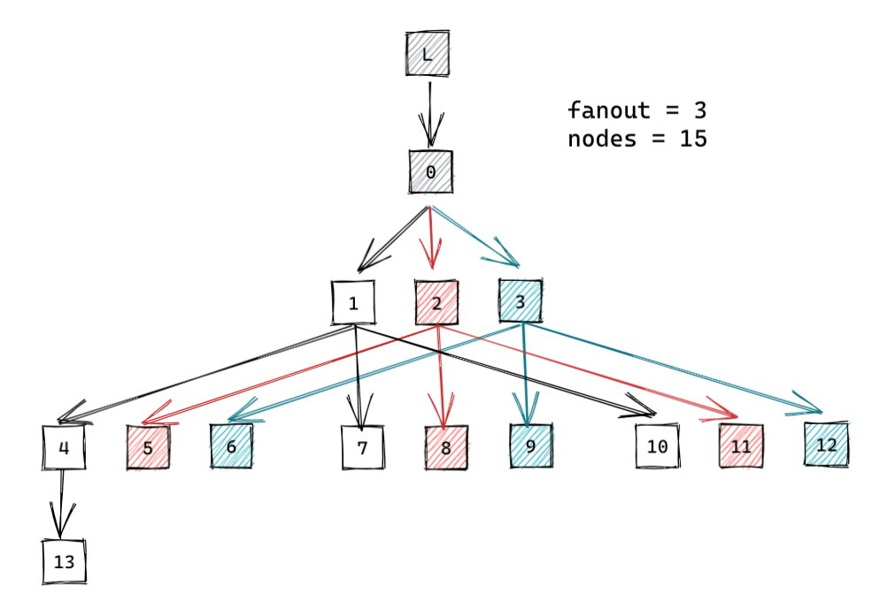

# TVU: tx validator unit 

- solana's transaction-validating-unit (TVU) is used to recieve, deserialize, verify, replay, and vote on new blocks generated by leaders. 
- while the transaction-processing-unit (TPU) is what the validator will focus on when its a leader/block-producer, the TVU is what it should be doing otherwise
- in this post we'll cover how the TVU works and its main stages
- if you want to follow along: well be working off of commit `c5905f5` - you can search the codebase for the functions and keywords mentioned 

## starting the validator

- when you run your validator a new `Validator` instance is created using `Validator::new`
- this initializes a lot of things, including the `TVU` calling `TVU::new`
- initializing the TVU starts up a few main stages 
  - shred fetch stage 
  - sigverify stage 
  - retransmit stage 
  - window service 
  - repair service 
  - and the replay stage 
- while there are more stages/procedures, these are the main ones we will cover in this article


## shred fetch stage

- the first stage is to recieve shred packets from other nodes (either directly from the leader or forwarded from another node) called the `ShredFetchStage`
  - since a block is too large to directly transmit over UDP, solana sends multiple chunks of a block called shreds instead
  - these packets transmitted through solana's [turbine](https://docs.solana.com/cluster/turbine-block-propagation)

- first, two main ports are opened to recieved packets:
  - tvu and repair ports 
  - the tvu_port will recieve shreds
  - the repair_port will recieve repair responses (well talk more about this in the repair service section)

note: the tvu_forwards port isnt used anymore ([ref](https://github.com/solana-labs/solana/pull/17716))

```rust
// src: core/src/tvu.rs

let TvuSockets {
    fetch: fetch_sockets, // TVU socket
    repair: repair_socket, // repair socket
    // ... other ports
} = sockets;

// ... 

let fetch_stage = ShredFetchStage::new(
    // input sockets
    fetch_sockets,
    forward_sockets,
    repair_socket.clone(),

    fetch_sender, // output of phase
    tvu_config.shred_version,
    bank_forks.clone(),
    cluster_info.clone(),
    turbine_disabled, // if retransmit stage should be enabled
    exit,
);
```

- for each of these ports, a thread is used to recieve packets (`streamer::reciever`) and modify them to include meta-data (`::modify_packets`) to either discard the packet or not
  - packets are discarded for a number of different reasons: 
    - if the shred's `shred_version` is different from the validator's `shred_version` 
      - `shred_version` is a reference to what hardforks the validator has gone through, 
    - if the shred is from an invalid `slot`
    - and more
  - the full filtering can be found in the function `should_discard_shred`

```rust 
impl ShredFetchStage {
  // ...

  // recieves packets from socket
  let (packet_sender, packet_receiver) = unbounded();
  let streamers = sockets
      .into_iter()
      .map(|s| {
          streamer::receiver(
            // ...
          )
      })
      .collect();

  // sets discard on packet if invalid and/or if turbine is disabled ...
  let modifier_hdl = Builder::new()
      .name("solTvuFetchPMod".to_string())
      .spawn(move || {
          Self::modify_packets(
            // ...
            sender, // sends to sig verify 
            // ...
          )
      })
      .unwrap();

}
```

- all these shreds are then sent to the `sigverify_shreds` stage through the `shred_fetch_sender` channel 

## sigverify stage 

- the sigverify stage verifies that the shreds from each slot are signed by the leader of that slot using either the GPU (if available) or the CPU
  - this is mainly done in the `verify_packets` function located in `core/src/sigverify_shreds.rs`
- when the shreds are verified they are passed to both the `WindowService` and the `RetransmitStage` using the `verified_sender` channel and the `retransmit_sender` channel respectively 

```rust 
let shred_sigverify = sigverify_shreds::spawn_shred_sigverify(
    cluster_info.clone(),
    bank_forks.clone(),
    leader_schedule_cache.clone(),
    fetch_receiver, // output from the shred-fetch stage

    retransmit_sender.clone(), // send to the retransmit stage
    verified_sender, // send to the window-service
);
```

## retransmit stage :: turbine

- the goal of the retransmit stage is to transmit the shreds recieved to the rest of the network using solana's turbine

- in turbine, every node is organzied in a tree structure, where the leader (of the current slot) is the root 
  - the nodes are then placed closer to the root if their stake is higher, and lower in the tree if their stake is lower

<div align="center">

</div>

- after recieving verified shreds, the node then computes the **turbine** tree to know which level its in the tree and which neighbours it should forward the shreds to
  - eg, in the figure, node 3 would compute its neighbours are 6, 9, and 12 and forward the shreds to them
- after this calculation, the shreds are forwarded to the neighbour's TVU ports

## window service 

- the sigverify stage also sends its shreds to the window service
- the window service handles storing new shreds in the `blockstore`
- this consists of two stages 
  - removing duplicate shreds using the function `start_check_duplicate_thread`
  - and inserting the shreds into the `blockstore` using the function `start_window_insert_thread`
- inserting shreds into the blockstore includes decoding the shreds into either data shreds or code shreds:
  - data-shreds are the pieces of block data (`ShredType::Data`)
  - code-shreds are the erasure information used to recover incomplete data shreds (`ShredType::Code`)
    - since shreds are sent over UDP and UDP has no delivery guarantees (packets could be randomly dropped)
- the data shreds are inserted directly into the `blockstore`
- code shreds are used to attempt to reconstruct incomplete data shreds, which are then also inserted into the `blockstore`
- which both the replay and repair service read from

```rust 
  pub fn insert_shreds_handle_duplicate<F>(
      &self,
      shreds: Vec<Shred>,
      // ...
  ) {

      for (shred, is_repaired) in shreds.into_iter().zip(is_repaired) {
          match shred.shred_type() {
              ShredType::Data => {
                  match self.check_insert_data_shred(
                      shred,
                      // store data shred
                  )
              }
              ShredType::Code => {
                  self.check_insert_coding_shred(
                      // store code shred
                  );
              }
          };
      }

      let recovered_shreds = Self::try_shred_recovery(
          // recover data shreds using code shreds
      );

      // insert recovered_shreds into blockstore next loop
    }
}
```

## repair service 

- the repair service sends requests to other validators for missing shred data (in case we never recieved it or were never able to reconstruct it with the code shreds)
- this includes scanning the `blockstore` for incomplete shreds using `generate_repairs_for_slot` (and `blockstore.find_missing_data_indexes(slot, ...)`)

## replay stage 

- the replay stage is responsible to processing the new blocks transactions (reconstructing the state), and sending votes new blocks

- while the window service includes shreds in the blockstore, the replay stage reads from the blockstore to contruct new banks/bank_forks 
- first the new slots from the blockstore are recorded to the `bank_forks` structure with the fcn `::generate_new_bank_forks`
  - `bank_forks` is the chain path including forks
  - a `bank` is the state of the chain at a slot - each slot will correspond to a bank 
- for each new slot, its child is first copied using `new_bank_from_parent_with_notify` and then txs are processed to generate the new state for that slot using `replay_blockstore_into_bank`
- the replay stage also sends votes on the banks its built using the function `select_vote_and_reset_forks` which finds a vote-able bank, constructs a vote transaction, and then sends it to the upstream leaders 

```rust
// src: runtime/src/bank_forks.rs
pub struct BankForks {
    banks: HashMap<Slot, Arc<Bank>>,
    descendants: HashMap<Slot, HashSet<Slot>>,
    root: Arc<AtomicSlot>,
}

// core/src/replay_stage.rs 
impl ReplayStage {
  pub fn new( /* ... */)
  loop {
      // Stop getting entries if we get exit signal
      if exit.load(Ordering::Relaxed) {
          break;
      }

      Self::generate_new_bank_forks(
          &blockstore, // read this
          &bank_forks, // to update this
          // ...
      );

      // replay to produce the full bank
      let did_complete_bank = Self::replay_active_banks(
        // ...
      );

      // ... 

      // send vote tx on vote-able bank
      Self::handle_votable_bank(
        vote_bank
        // ...
      ); 
  }
}
```