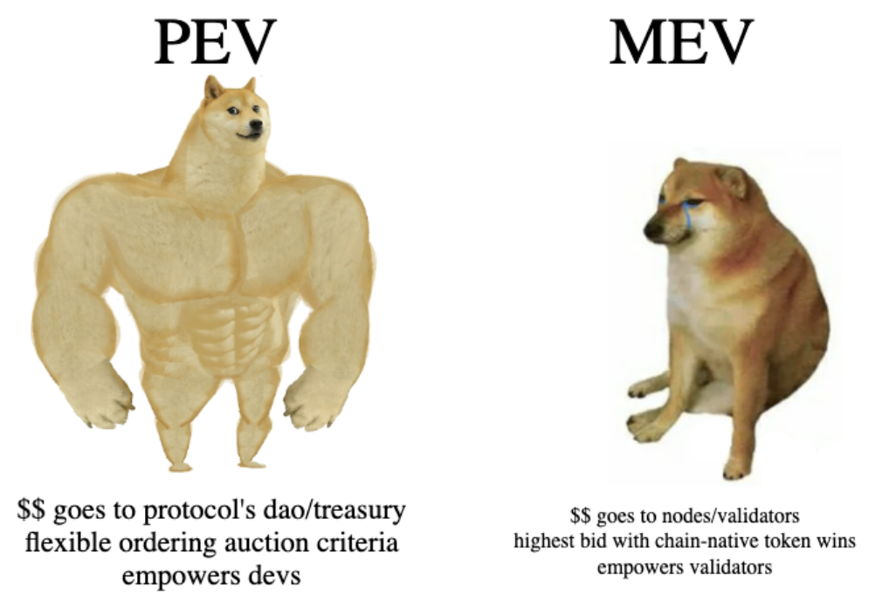

# PEV: Protocol Extractable Value

**tldr;** validators are able to extract value from chains due to their ability to decide transaction orderings however, if protocols start to record requests and execute the requests in batches, then protocols can enable begin to extact MEV/PEV (Protocol Extractable Value) which can be given to the protocol's dao, treasury, or users. 

## Introduction

Right now the key players in MEV are the validators and the searchers. 
Validators are the nodes of the network which produce blocks of multiple 
transactions (txs) and searchers are the users who find money-making opportunities which rely on a specific ordering of txs to realize a profit. To ensure the searcher realizes a profit they usually bribe the validators to use their ordering. Though these two entities are well known, a lesser known MEV player is the protocols themselves. 

<div align="center">

</div>

To gain a better understanding, it's helpful to understand how a protocol can emulate a validator based on implementation. For 
example, consider a protocol which collects N requests (eg, an example request for an AMM could be "swap 50 ETH for BTC") and then executes all the 
requests on the N+1th request. Similar to a validator producing blocks of txs, the protocol is producing protocol-level blocks: txs that only interact with the protocol. 

Now consider if the protocol allows for users to bid on 
a certain ordering of the requests and the ordering which corresponds with the highest bid is executed. This is protocol extractable value (PEV).

Another way to think of it is since validators are paid to execute transactions in a specific ordering and transactions 
are just chunks of code, searchers are paying for a specific execution of code, and 
when all that code belongs to a single protocol, the searchers should be able to (with the correct implementation) pay the protocol for a specific ordering. This is because the protocol owns the lowest level of code execution, ie, the protocol **is** the code. 

## Winning PEV Orderings

Naturally, when we're talking about an auction (for code execution), we need to define
who wins the auction. While most blockchains require their payment in the chain's native token (SOL on solana, ETH on ethereum, etc) since the protocol is designing the auction code themselves, they can decide the auction winner based on a much more flexible criteria which best fits the protocol's needs: 
- payment in the *protocol's* native token
- payment in a stablecoin
- the amount of the protocol's native token that is *staked*
- based on metrics that the ordering of requests achieves (eg, the ordering which achieves the smallest average amount of slippage - cowswap)
- ... 

## Similarity to the Cosmos Chain

This is very similar to how the cosmos blockchain allows protocols to run their chain so that protocols can define their own validator logic. While in cosmos you lose
the ability to compose with other dapps built on the other chains (ie, going from ETH to cosmos you lose composability with all other ETH dapps). In this scenario, you get more of both worlds: extractable value while remaining composable with other dapps. 

## What's Happening Now 

This means protocols are currently giving available MEV to the validators. If protocols 
begin to implement validator-like logic in their contracts this could enable protocols to capture more value which can go 
back to protocol's dao, treasury, or users. 

## POC: PEV AMM Swaps 

For example, consider a simple AMM which swaps tokens with the x*y=k formula. This
would consist of the following:
```python 
def swap(amount: int, direction: A2B | B2A): 
    # compute swap output based on xy=k 
    # decrement user input token amount
    # increment user output token amount 
    # update amm parameters x and y
```

However, we can enable PEV with the three following functions 
```python
def PEV_swap(amount: int, direction: A2B | B2A): 
    # if no auction: start a new ordering structure
    # record swap parameters (user, amount, direction)
    # if auction time is over: end_auction()

def end_auction():
    # compute the winning ordering 
    # bid_winner's balance -= bid_amount
    # protocol's balance += bid_amount
    # fufill the swaps in the order of the ordering 
    # for swap_params in winners_ordering: swap(**swap_params)

def place_ordering_bid(bid_amount: int, ordering: Ordering):
    # record bid amount and corresponding ordering
```

## Related Work: CowSwap

Similar to PEV but instead using a general auction-based ordering, [cowswap](https://cow.fi/) defends against toxic MEV
by allowing searchers to submit orderings which achieve the best price improvement for the users who want to swap
(based on some criteria) and the ordering which achieves the best price improvement earns a slice of the total fees. 

## Acknowlegements 

s/o bigz for bringing up the idea and the great discussions. 