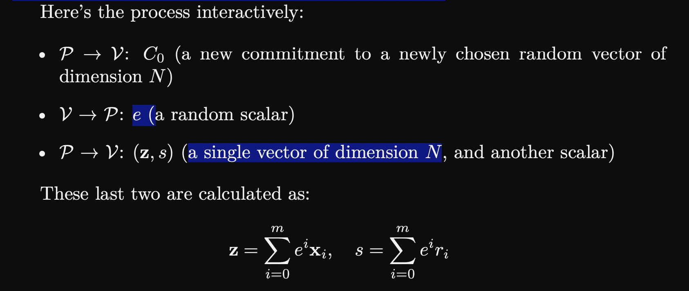
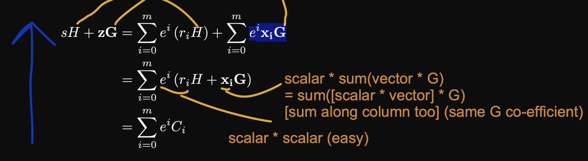

# Random Thoughts: Zero Knowledge to BulletProofs 

This will contain random thoughts on [this text](from0k2bp.pdf). 

## ZK commitments on a set of vectors 

- in the text the approach is as follows


which lead to the following questions:
- **how do we compute $z$** ? (the sum doesnt really make sense with a vector and a scalar)
- **why do we need $C_0$**? (a random vector) we already gave the verifier the other $C$s, shouldnt that be enough?

## Computing $z$

We can better understand $z$ by reverse engineering the proof that the math adds up

If we look at the proof verification we are trying to prove the following equation holds 


it helps to work through the following equation backwards:


- starting with the $eC$ equation we expand $C$
- we can then apply the e terms to the rest of the brackets 
  - since $e$ and $r$ are scalar values their multiplication is also a scalar (pretty easy to understand)
  - but since $e$ is a scalar and $x$ is a vector its a little more complicated:
  - note $xG$ is actually $x_0G_0 + ... + x_nG_n$ for all the vector components of $x$ and $G$ 
  - so multiplying this term by $e$ is equivalent to $ex_0G_0 + ... + ex_nG_n$ 
  - and since we are doing this operation over multiple commitments, we'll have this sum for each $C_i$ 
  - so we can simplify the $G_0$ co-efficient by collecting the terms: $e(x_{0{C_0}} + x_{0{C_1}} + ... + x_{0{C_N}})G_0 + ... + e(x_{n{C_0}} + x_{n{C_1}} + ... + x_{n{C_N}})G_n$
  - we can then set $z_0 = e(x_{0{C_0}} + x_{0{C_1}} + ... + x_{0{C_N}}$ - and for all the other co-efficients too
  - which leads to: $z_0G_0 + ... + z_nG_n = zG$
  - which completes the proof $\square$

notice how the $x$ values are hidden through the summation operations 

this can be efficiently implemented in python with the following 

```python 
x = [[1, 2, 3],
    [2, 3, 4]]

# proof 
# G x = [[G0 1, G1 2, G2 3],
#     [G0 2, G1 3, G2 4]]
# G x e**i = [[G0 1 * 1, G1 2, G2 3],
#     [G0 2 * e, G1 3 * e, G2 4 * e]]
# G x e**i = [[G0 (1 * 1 + 2e), G1 (2 + 3e), G2 (3 + 4e)]]
# G x e**i = G [[1 + 2e, 2 + 3e, 3 + 4e]]

# ie, in matrix multiplication form:
# coefficients = [ [1], 
#                  [e],
#                  [e**2]]
coefficients = [e ** i for i in range(len(x[0]))]
# (1 x 3) @ (3 x 3)
z = coefficients @ x
```

## Why do we need $C_0$?

Suppose we dont use $C_0$ and just commit our vector commitments $C$ instead. Things begin to break when we commit to a single vector. Why? 

Looking at our calculations for $z$ and $s$: 


when m=0 (using a single vector) we get $s= e^0 * r_i = r_i$ - so we end up exposing $r$ which is suppose to the be the secret binding factor for our commitment:


From this an attacker can more easily brute-force check possible $x$ values - reducing the security of the commitment. 

### How does $C_0$ help?

So we need $C_0$ but why? - Well in the same scenario but using $C_0$ we end up hidding our $r$ values through the summation $s = r_0 + e * r_1$. 

Notice how this equation for the $s$ values is the same equation for schnorr's zk proof!

This means that $C_0$ is playing a similar role to the random $k$ value chosen in schnorr's algorithm - interesting eh.


