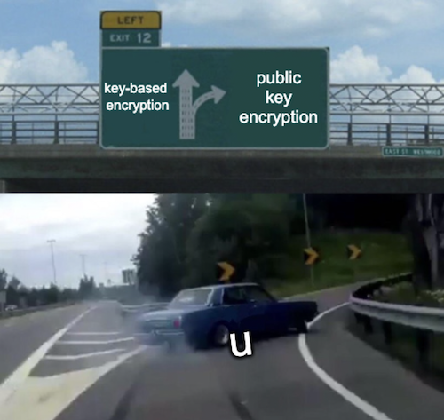

# RSA Public-Key Cryptography 

## Key-based VS Public Key 

If you want to securely communicate with another person, the classic approach is to use 'key-based encryption' which assumes you and the other person have a shared secret key between each other. This secret key is then used to encrypt and decrypt messages using a specific algorithm (ie, AES) for secure communication. 

Now assume that you want to securely communicate with a random server on the internet. How do you agree on a secret key with the random server? You can't securely communicate without the secret key, and you can't agree on a secret key without unsecure communication. 

This is where public-key crypto comes in. **Public-key crypto allows you to securely communicate without assuming a shared secret.** Imagine two parties Alice and Bob want to communicate. 

---

At a high-level public-key crypto works as follows: 

- Alice will create a box, a lock, and a key for the lock. 
- Alice will keep the key for the lock to herself and send the box and lock to Bob. 
- Bob can then insert his message into the box, lock it, and send it back to Alice. 
- Alice can use her key to unlock the lock, open the box, and read Bob's message. 

Notice an attacker can only intercept either the box and the lock (on the way forward), or the locked box (on the way backwards). Neither of which can compromise the communication (we'll ignore man-in-the-middle attacks in this post). 

The rest of this post will go into detail about how RSA, a popular public key crypto algorithm, works.  

## Terminology

Analogously, the box and the lock is called the public key, and the lock's key is called the private key.

## The Algorithm 

The RSA algorithm works as follows:

relating [the algorithm](https://cacr.uwaterloo.ca/hac/) back to the high-level overview, 
- Alice generates a public [n, e] and private key [d] (derived from two prime numbers)
- Alice sends her public key [n, e] to Bob 
- Bob encrypts his message to Alice: $m ^ e \mod n$
- Bob sends the encrypted message to Alice 
- Alice decrypts the message: $(m ^ e)^d \mod n = m \mod n$

## Proving RSA Encryption/Decryption works 

While its difficult to explain the intuition and origin behind RSA, it can help to understand RSA by proving its encryption/decryption works.  

---

Essentially, we want to prove: $(m^e)^d = m \mod n$

where $m^e$ is the encrypted message 

and $(m^e)^d = m$ is the decrypted/original message

---

first we'll prove something easier: 

$m^{ed} = m \mod p$

since we're working with $\mod p$, consider the greatest common denominator (gcd) of some message $m$ and the prime number $p=5$:
- gcd(m, p) = ... 
- gcd(1, 5) = 1 (m < p)
- gcd(2, 5) = 1 (m < p)
- gcd(3, 5) = 1 (m < p)
- gcd(4, 5) = 1 (m < p)
- gcd(5, 5) = 5 (m = p)
- gcd(...any value..., 5) **cannot equal** {6, 7, 8, ...} 

Analyzing above, we can see that gcd(m, p) $\leq$ min(m, p) $\leq$ p [footnote 1], and so there are two cases we need to prove: 
1. when m < p: then **gcd = 1** bc p is prime 
2. m = p: then **gcd = p**

*footnote 1*: bc p/N < 1 when N > p, aka not a whole number. And so N > p cannot be a gcd(.., p), so we know gcd(.., p) $\leq$ p.

...

then we just need to prove $(m^{ed} = m \mod p)$ in two cases: 

---

1. if gcd(m, p) = 1 ... then

---

$m^{p-1} = 1 \mod p$ [by fermats little theorem]

$(m^{(p-1)})^{k(q-1)} = 1^{k(q-1)} \mod p$ 

$m^{k(p-1)(q-1)} = 1 \mod p$ [exp doesn't change right-side]

$m * m^{k(p-1)(q-1)} = m * 1 \mod p$

$m^{1 + k(p-1)(q-1)} = m \mod p$ 

$m^{1 + k\phi} = m \mod p$ [defn of $\phi$]

$m^{1 \mod \phi} = m \mod p$ [defn of $\mod \phi$]

$m^{ed} = m \mod p$ [by defn of $ed$]

---

2. if gcd(m, p) = p ... then we can simplify both sides:

---

**right side:** $m \mod p$

$m * k \mod p$ [$m = k * p$ for some $k$ by defn of gcd]

$p \mod p$ 

$0$

--- 

**left side:** $m^{ed}$

$(k * p)^{ed} \mod p$ 

$k^{ed} * p^{ed} \mod p$ [mul & exp]

$0$

---

similarily, the proof is the same for the case of $q$. And so we have proved: 

$m^{ed} = m \mod p$

$m^{ed} = m \mod q$

then, by the chinese remainder theorem we also have

$m^{ed} = m \mod (p * q)$

$m^{ed} = m \mod n$

and that's the proof :) 

## Breaking RSA 

So how can an attacker break it? 

First, lets consider whats public and private: 

- public: (n, e)
- private: d 

if an attacker, given (n, e), could derive d, then they could decrypt any messages sent to Alice. How can we derive d? 

imagine we can decompose n and find the corresponding p and q values. Then we could compute $\phi$, followed by computing $d$. Once we have $d$ we can decrypt anything. Turns out decomposing n is very difficult for a large enough p and q values and so its pretty secure. 

## Elliptic Curve Digital Signatures 

... 