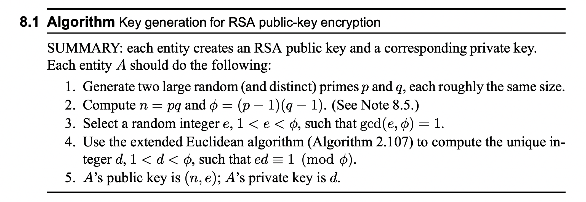

# RSA Public-Key Cryptography 

## Public Key Cryptography Intro

Classic crypto uses key-based encryption which assumes two parties, who want to securely communicate, have a shared secret key only known between them. The secret key is then used to encrypt and decrypt messages for secure communication. 

This naturally leads to the question of how do two parties communicate the secret key to each other? Sending the secret key directly through the internet could be intercepted leading to compromised communication.

This is where public-key crypto comes in. It allows you to securely communicate without a shared secret. At a high level, imagine two parties Alice and Bob want to communicate. In public-key crypto, Alice will send a box and a lock to Bob and will keep the key to the lock to herself. Bob can then insert his message into the vault, lock it, and send it to Alice. Alice can then unlock the vault and read the message. 

The rest of this post will go into detail about how RSA crypto works (a standard public-key crypto algorithm). 

## Terminology

To expand the previous high-level explanation with proper terminology, at a high level, RSA works as follows: 

- Alice will generate a public and private key 
- she will send her public key to Bob 
- Bob can then encrypt their message to Alice using her public key 
- and send it back to Alice 
- Alice can decrypt messages with her private key 

The public key is the box & lock, and the private key is the lock's key.

## The Algorithm 

relating [the algorithm](https://cacr.uwaterloo.ca/hac/) back to how it works, 
- Alice generates a public [n, e] and private key [d] [derived from two prime numbers]
- Alice sends her public key [n, e] to everyone 
- people encrypt their message to Alice: $m ^ e \mod n$
    - *note:* they must represent their message using only values in the interval [0, n − 1] for correct decryption 
- the encrypted message is sent to Alice 
- Alice decrypts the message: $(m ^ e)^d \mod n = m \mod n$

## Proving it works 

- while its difficult to explain the intuition and origin behind the algorithm, it can help to prove that it works  

- essentially, we want to prove: $(m^e)^d = m \mod n$
    - where $m^e$ is the encrypted message 
    - and $(m^e)^d = m$ is the decrypted/original message

first we'll prove something easier which will help us: 
- $m^{ed} = m \mod p$

with the greatest common denominator denoted as gcd, since we know that gcd $\leq$ min(m, p) $\leq$ p [footnote 1], there are two cases we need to prove: 
1. m < p: then gcd = 1 bc p is prime (and so there aren't any other common factors)
2. m = p: then gcd = p 

*footnote 1*: bc p/N where N > p will always be < 1, aka not a whole number and thus not a gcd, so we know gcd $\leq$ p

For example, consider gcd of an $m$ and prime $p=5$:
- gcd(m, p) = ... 
- gcd(1, 5) = 1 (m < p)
- gcd(2, 5) = 1 (m < p)
- gcd(3, 5) = 1 (m < p)
- gcd(4, 5) = 1 (m < p)
- gcd(5, 5) = 5 (m = p)
- gcd(...any value..., 5) **cannot equal** {6, 7, 8, ...} (gcd $\leq$ min(m, p) $\leq$ p)

...

then we can now prove the two cases: 

1. if gcd(m, p) = 1 ... then
    - $m^{p-1} = 1 \mod p$ [by fermats little theorem]
    - $(m^{(p-1)})^{k(q-1)} = 1^{k(q-1)} \mod p$ 
    - $m^{k(p-1)(q-1)} = 1 \mod p$ [exp doesn't change right-side]
    - $m * m^{k(p-1)(q-1)} = m * 1 \mod p$
    - $m^{1 + k(p-1)(q-1)} = m \mod p$ 
    - $m^{1 + k\phi} = m \mod p$ [defn of $\phi$]
    - $m^{1 \mod \phi} = m \mod p$ [defn of $\mod \phi$]
    - $m^{ed} = m \mod p$ [by defn of $ed$]

2. if gcd(m, p) = p ... then we can simplify both sides to show they are equal:
    - right side: $m \mod p$
        - $m * k \mod p$ [$m = k * p$ for some $k$ by defn of gcd]
        - $p \mod p$ 
        - $0$
    - left side: $m^{ed}$
        - $(k * p)^{ed} \mod p$ 
        - $k^{ed} * p^{ed} \mod p$ [mul & exp]
        - $0$

Similarily, the proof is the same for the case of $q$. And so we have proved: 
- $m^{ed} = m \mod p$
- $m^{ed} = m \mod q$

then, by the chinese remainder theorem we also have
- $m^{ed} = m \mod (p * q)$
- $m^{ed} = m \mod n$

and that's the proof. So we know RSA's encryption and decryption work. 

## Breaking RSA 

So how can an attacker break it? 

First, lets consider whats public and private: 

- public: (n, e)
- private: d 

if an attacker, given (n, e), could derive d, then they could decrypt any messages sent to Alice. How can we derive d? 

imagine we can decompose n and find the corresponding p and q values. Then we could compute $\phi$, followed by computing $d$. Once we have $d$ we can decrypt anything. Turns out decomposing n is very difficult for a large enough p and q values and so its pretty secure. 