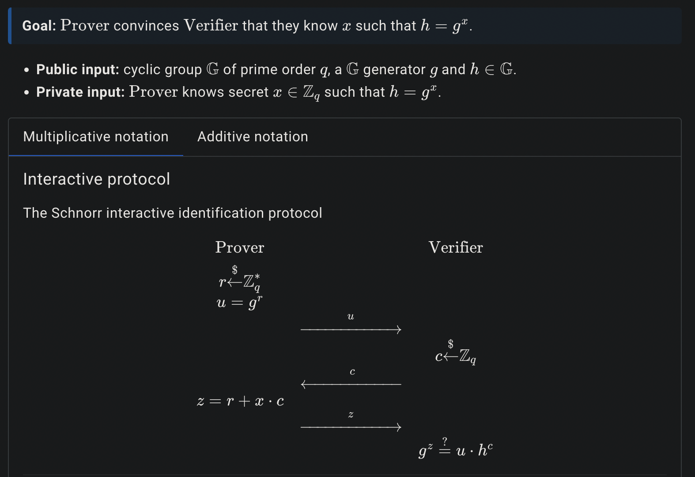

# ZK 101: Schnorr's Protocol 

If you use crypto and own the latest shitcoins, then you own a wallet consisting of a public and private key. 

**Lets say you want to prove to your friends that you own your public key (and all the shitcoins belonging to it).** One way to do so would be to show your friend your private key, but that would be bad because they could sign any transaction and steal all your shitcoins. 

<div align="center">

</div>

Ideally, you want to prove to your friend you own a private key corresponding to your public key without revealing any information about your private key. 

**In this post we'll cover how to prove you know your private key without revealing it using a zero-knowledge (ZK) proof and implement it in python.**

## Schnorr’s Identification Protocol 

We first define some things: 
- $x$: is our private key 
- $g$: is some value/message (can be anything)
- $h$: is g encrypted with our private key ($h = g^x$)
- $q$: is our modulus value (its the same as $n$ in the last RSA post)


**figure 1** from [here](https://www.zkdocs.com/docs/zkdocs/zero-knowledge-protocols/schnorr/)

Breaking this figure down further, the public inputs are q (our mod value), g (some message), and h (the message encrypted). 

In python, we can set it up as so

```python 
import rsa
import numpy as np 

## generate the public and private keys 
(pub, priv) = rsa.newkeys(128)
e = pub.e # public key 
q = pub.n # mod value 
x = priv.d # private key -- we want to prove we know x

g = 19 # can be anything 
h = pow(g, x, q) # encrypted message
```

The heart of the ZK proof utilizes the math theorem,
$$
x^a * x^b = x^{a + b}
$$

we'll see how its used later.

*Footnote:* Related to this is *homomorphic hiding* which is a way to operate on encrypted data.

We start by generating a random value $r$ to encrypt our message $g$ with, deriving $u$. We then send $u$ to our friend. 

```python 
r = np.random.randint(0, 1e3)
u = pow(g, r, q)
```

The friend computes a new random value $c$ and sends it back to us. 

```python 
c = np.random.randint(0, 1e3)
```

We then compute $z = r + x * c$ and send $z$ to our friend. 

```python 
z = r + x * c 
```

They can then check if the following equality holds:

$$
\begin{equation}
g^z \stackrel{?}{=} u * h^c 
\end{equation}
$$

```python 
left_side = pow(g, z, q)
right_side = (u * pow(h, c, q)) % q

assert left_side == right_side # True 
```

To know why this works we can expand the variables and simplify 
$$
g^z \stackrel{?}{=} u * h^c \\ 
g^{r + x * c} \stackrel{?}{=} g^r * (g^x)^c \\
g^{r + x * c} \equiv g^{r + x * c} 
$$

Notice how in (1) our friend has no information on our private key, $x$ They only know $z$, $u$, $h$, and $c$. Furthermore, we would only be able to give them a $z$ which makes (1) true if we know the private key $x$! 

pretty cool stuff 
