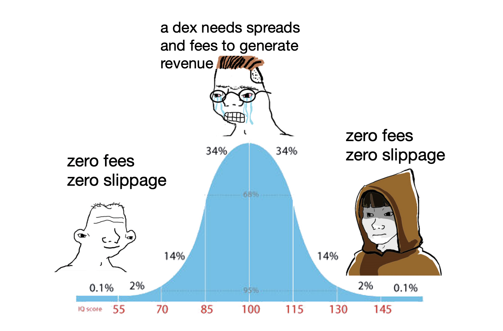

# Zero-fee, Zero-slippage, Revenue Generating, Perps Dex

Defi dexs have evolved over time from CLOBs/AMMs (serum/uniswap) to perp CLOBs/AMMs (mango/drift) to oracle-based zero-slippage perps (GMX) and other crazy ideas. Defi allows wild ideas to flourish since anyone can deploy a contract and anyone can trade through that contract to win/lose money. While zero-slippage is in a land of its own, this post will talk about something even more insane - how we can achieve a zero-slippage AND zero-fee perp dex that still earns money.

## settling pnl & pnl pools

First we need to introduce some implementation details on how perp dexs actually work.

When implementing a dex, positions are defined as some amount of base (SOL) and some amount of quote (usdc) - when you open a long position base increases (++) and quote decreases (--) (opposite for opening a short). When someone closes their position they are left with a corresponding amount of quote which is their pnl. for example, going long 1 SOL for 100 usdc is [1 base and -100 quote], and then closing this position for 120 usdc leads to [0 base and 20 quote]; a pnl of 20. Notice how the **base, quote, and pnl are only updated when opening and closing a position.**

However, when trading against another party, this +20 pnl needs to correspond to another's -20 pnl, but a user's collateral isn't updated until their position is closed. If that opposite side doesnt close their position, this leads to users having pnl thats non-withdrawable. 

**The solution is to settle all of the trader's pnl periodically from their collateral into a pnl pool.** Positive pnl takes money out of the pool and negative pnl puts money into the pool. Then, all positive pnl thats settled from the pool can be safely withdrawn from the exchange since we know someone else has lost that much. 

## zero-fee perp dex 

Dexs usually earn revenue from spreads (amms only) or through trading fees, however a zero-fee zero-slippage dex cant earn revenue from either of these streams. So how do we do it? **The trick is to have the protocol take a slice of the pnl pool periodically.** For the user, trading on this dex would be a trade-off between paying zero trading fees but having a lower probability of being able to withdraw all of your profits. 

Interestingly, this is equivalent to reducing the position size of the losing positions on the dex: if the dex has 100 longs and 100 shorts and the price goes down, the protocol will take a slice of the longs negative pnl - which is similar to having 90 longs and 100 shorts and the protocol taking nothing. 

--- 

fin

<!-- note 

intro 

the defi path seems to have started from CLOBS -> AMMs -> perps -> perps (with AMMs or CLOBS) -> zero-slippage perps ... 
but where to next? the reason i started defi was because of the idea that if you can think of a crazy idea, you 
can actually implement it and others can use it to earn or lose their money - it doesnt matter who you are 
you deploy it and anyone can use it. so where to next? this will intro a new perps dex which could be even more insane - 
it basically can allow zero-fee perps while the protocol earns money. How can a perp earn money without fees? first we need to intro some implementation details of perps. You can checkout this primer for the basics of perps [link]

- defi dexs have evolved over time 
- defi allows crazy ideas to financial ideas to flourish
- zero-slippage perps exist
- how can we achieve zero-fee dexs 

settle pnl

- the way exchanges work is you have a base and quote amount (btc and usd)
- when you open a long base++ and quote-- 
- when you close a long (go short) base-- and quote++
- ie if you long 1 btc for 100$ (1 base -100 quote), and when you close 1 btc for 200$ (-1 base +200 quote)
    the net effect is 0 base 200 quote 
- ideally you should then be able to withdraw your 200 usd from the exchange 
- however, notice how the pnl of a user doesnt actually exist until the position is closed 
- this could lead to some strange behaviour when not accounted for - ie, allowing them to withdraw can lead to all the exchanges collateral being emptied from a single trader!
- the soln is to 'settle' a users pnl periodically to a pnl pool
  - positive pnl takes money out of the pool 
  - negative pnl puts money into the pool 
- then all the positived pnl thats settled can be saftely withdrawn from the exchange bc someone else has lost that money 

- positions are implemented as an amount of base and quote 
- a trade between two parties requires both parties to open and close positions to recieve their pnl
- however, in an exchange when one side of the trade closes, the other doesnt always 
- leading to unwithdraw-able funds 
- the solution is to settle user's pnl periodically using a pnl pool 
- funds withdrawn from the pool are saftely withdraw-able 

## long/short imbalance

- when it comes to AMMs/oracle-based perp dexs (Drift and GMX) users can take positions 
- without any other trader taking the other side the problem is that 
- this can lead to having too many longs and not enough shorts 
- if the price goes up in this situation then there wont be enought pnl 
- in the pnl pool for the longs to all settle their profits (since everyone won and noone lost)

## blah 

assume a perp dex allowed zero-slippage (ie, they cant earn money from the spread) and zero-fee (they cant earn money from trades) how can they earn money? the trick is to take a slice of the pnl pool - as traders lose money, the pnl pool will be funded with exccess pnl to withdraw from so the dex can periodically pull x% of the pnl from the pool into its own wallet as a replacement for the fee. this will lead to an imbalance of pnl between the winners and losers, which would require more losers to fund the winners - however, since perps dex are all trading virtual liquidity (ie, you dont actually get any tokens) this is just a trade off between reduce fees but increases long/short imbalance. traders run the 
risk of not being able to withdraw their profits but are able to trade with zero fees!

- dexs usually earn revenue through spreads (amms only) or fees
- however, a zero-slippage zero-fee dex cant earn from either 
- the trick is to take a slice of the pnl pool periodically 
- this becomes a trade off between trading fees and being able to withdraw your profits 
- also, by taking pnl from the pnl pool is equivalent to reducing the position size of the loser
- this means this model is increasing the long/short dex imbalance problem to set the fees to zero

- -->